# **Exercise 1: Deploying a Horizon Cloud Service Pod**

**About Pod Deployment**

In this series of exercises, you deploy a Horizon Cloud Service pod and bind it to an existing Active Directory domain. This grants the Horizon Cloud Service control plane access to create and manage resources in Microsoft Azure. These exercises are sequential and build upon one another, so make sure to complete each exercise in this section before going to the next.


## **Exercise 1.1: Deploying the Horizon Cloud Service Pod**

Armed with the prerequisite information from your Microsoft Azure tenant, you are now ready to begin deploying the Horizon Cloud Service pod and binding it to an existing Active Directory domain.


For more information, see [_Getting Started with VMware Horizon Cloud Service on Microsoft Azure_](https://docs.vmware.com/en/VMware-Horizon-Cloud-Service/services/hzncloudmsazure.getstarted15/GUID-6E460805-C323-4200-9A45-45E7BFB31730.html).


### **Task 1: Connect to AdVM**

1. Navigate to your environment, where a virtual machine (JumpVM) on the left and lab guide on the right will get loaded in the browser.

   

2. Connect to **AdVM**, double click on **ADVM_RDP** file. On Remote desktop connection window, click on on **Connect**.

   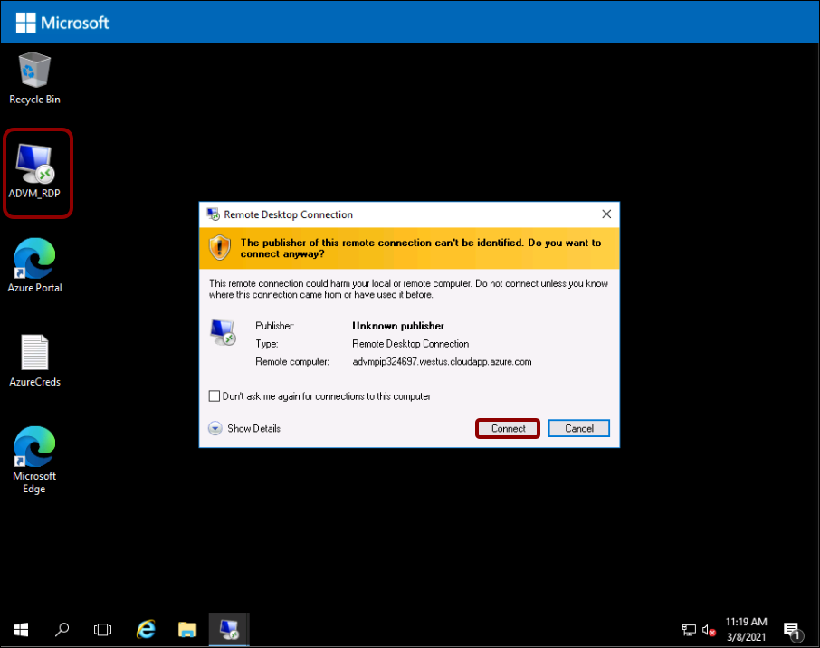

3. Enter the password **<inject key="AD VM Admin Password" />**

   

4. On Remote desktop connection window, check the _Don't ask again_ box and click on **Yes**.

   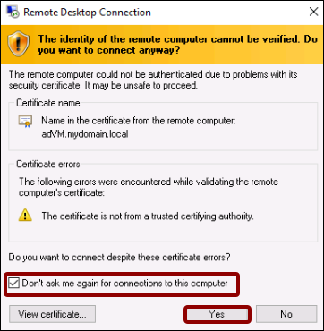
 
5. ADVM will launch as shown below. Use this virtual machine throughout the workshop to perform the the lab.

   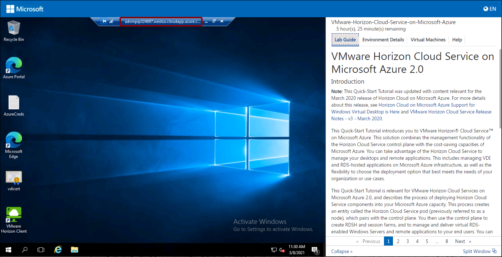


### **Task 2: Log in to VMware Horizon Cloud Service**

1. Open Microsoft Edge browser shortcut given on the desktop in ADVM, and browse the URL given below.

   ```https://cloud.horizon.vmware.com/login2/login```

   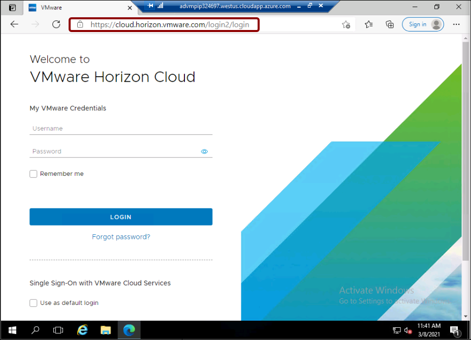

2. Next to the lab guide tab, navigate to **Environment Details tab > VMWare Horizon Account Details** and copy the credentials by clicking on copy button.
  
   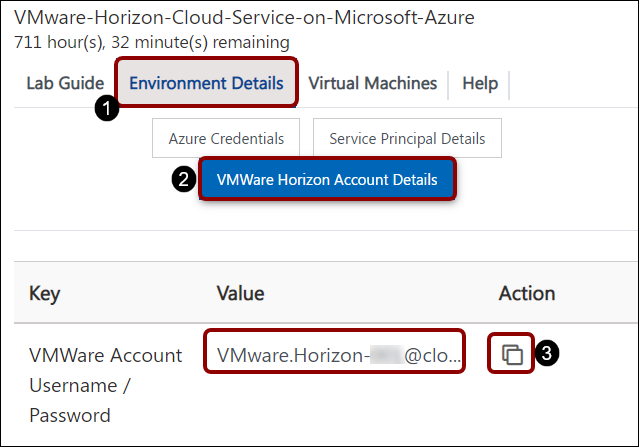
   
3. Now open notepad and paste the credentials there.

   

4. Go to Login page, copy the username and password from notepad and paste under _My VMWare Credentials_, then click on **Login**.

   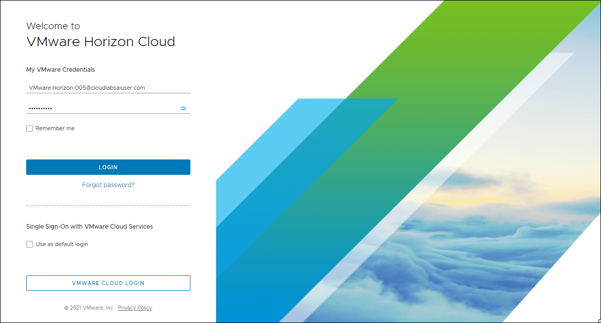

**Note:** You may be prompted with a _Terms of Service_ popup, click on  **ACCEPT** to continue.

   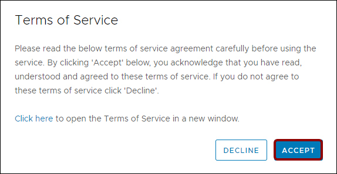


### **Task 3: Add a New Horizon Cloud Service Pod**

1. By default, you will be directed to the **Getting Started** page. In the upper right corner of **Microsoft Azure** pane, click on **MANAGE** and the select **Add Pod**. Adding capacity is equivalent to deploying a pod in a capacity environment and connecting that pod to your overall Horizon Cloud environment.

   
   

### **Task 4: Provide Subscription Details**

1. In the Add Microsoft Azure Capacity tab, add the following values:

   - Apply Subscription: Select **Add New** and enter the new subscription information.
    
   - Subscription Name: **<inject key="Subscription Name" props="{\&quot;enableCopy\&quot;:true,\&quot;style\&quot;:{\&quot;fontWeight\&quot;:\&quot;bold\&quot;}}" />**
   
   - Environment: Select **Azure - Commercial** from the drop down.
 
   
 
To fill the below given fields, navigate to **Environment Details tab >  Service Principal Details** then copy and paste the corresponding values:

   - Subscription ID: Use the **Subscription ID** from Service Principal details page
    
   - Directory ID: Use the **Tenant ID** from Service Principal details page
    
   - Application ID: Use the **Application ID** from Service Principal details page
    
   - Application Key: Use the **Secret Key** from Service Principal details page
   
   - **Use a Different Subscription for External Gateway:** Accept the default and leave this option disabled.

   

2. In the lower right corner, click **ADD**.

### **Task 5: Provide Pod Setup Details**

1. In the Details panel of the Pod Setup tab, provide the following information:

   **Note:** If there is an option to select **Site** then select **Existing**
   
   - Pod Name: **pod-test**
    
   - Location: _Click_ **Add** _to specify a location, which you can use to group pods according to categories that you provide, such as Business Unit A, Business Unit B, and so on. As you enter a city name, it should auto-populate. If your city name is not recognized, it will not be placed correctly on the Dashboard map. In this case, select the closest city available._
    
   - Microsoft Azure Region: **West US**

   - Description: _Enter an optional description for this pod._

   

2. Scroll down to the next panel.


### **Task 6: Provide Networking Details**

1. In the Networking panel of the Work Setup tab, provide the following information:

   - Disable High Availiblity by **toggling off** the Enable switch
    
   - Virtual Network: Select **HZN-Vnet[Horizon-Network-RG]** from dropdown.
    
   - Use Existing Subnet: Slide to **enable**.
    
   - Management Subnet: Select **Mgmt-subnet** from dropdown.
    
   - VM Subnet - Primary: Select **VM-subnet** from dropdown
    
   - NTP Servers: **time.windows.com**
    
   - Use Proxy: Leave this **disabled**.

   

2. In the Identity Management panel, accept the default, and click **Next**.

### **Task 7: Provide Unified Access Gateway Details**

1. In the Unified Access Gateway panel of the Work Setup tab, provide the following information.
    
   - **Enable External Gateway?:** Slide to **disable**.
    
   - **Enable Internal Gateway?:** Slide to **enable**.
    
   - **FQDN:** Enter **vdi.mydomain.local**
    
   - **DNS Addresses** **<inject key="DNS Server IP" />**
        
   - **Route:** Leave blank.
   
   - **VM Model:** Standard_A4_v2
    
   - **Certificate:** Click on **Upload**. Navigate to **C:\LabFiles** and select **vdicert** file.

   - For this exercise, leave the two-factor identification settings disabled.

   - enable **Inherit Pod tags**

    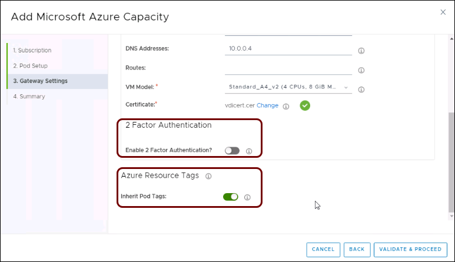

2. Click on **VALIDATE & PROCEED**.

   

### **Task 8: Review Summary**

1. Review the summary, verify that the information is correct and complete, and then click **SUBMIT**.

**Note: This process will take approximately 60 to 120 minutes to complete.**

   


### **Task 9: Verify That the Pod Is Deployed**

1. We will wait until the green check mark appears, which indicates that the Horizon Cloud Service pod and all supporting infrastructure components are deployed.

   
   

After you finish deploying the Horizon Cloud Service pod, proceed to the next exercise to perform the domain bind operation.


## **Exercise 1.2: Binding to the Active Directory Domain**

Machine creation and domain join operations are automated by Horizon Cloud Service. The domain bind operation must be performed on the pod before creating images and farms. You have several Active Directory domain configurations to choose from. For more information about these options, see [_Getting Started with VMware Horizon Cloud Service on Microsoft Azure_](https://docs.vmware.com/en/VMware-Horizon-Cloud-Service/index.html).


### **Task 1: Get Started**

To complete the Active Directory configuration, provide information about the domain and accounts used for domain operations.

1. In the Getting Started wizard, locate the **Microsoft Azure, 1 Pod** added in _Capacity_ section.

2. Under _Capacity_ section, click on **General Setup** to expand the fields.

   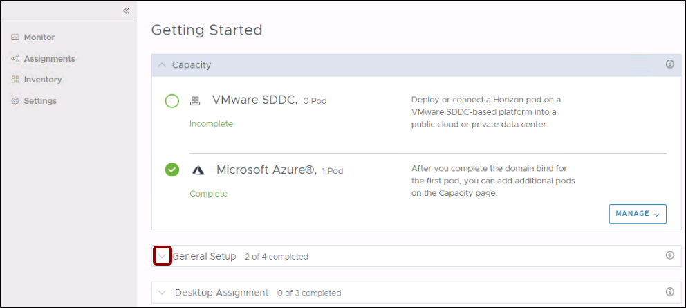


### **Task 2: Configure Active Directory**

1. Under General Setup, locate the **Active Directory** panel.

2. On the far right, click on **Configure**.

   


### **Task 3: Register Active Directory**

1. In the Register Active Directory window, provide information about the domain and accounts used for domain operations.

   - **NETBIOS Name**: **<inject key="Domain NETBIOS Name" />**
   
   - **DNS Domain Name:** **<inject key="Domain Name" />**
   
   - **Protocol:** Accept the LDAP default.

   - **Bind Username:** **<inject key="Domain Bind Account" />**

   - **Bind Password:** **<inject key="All Account Password" />**
   
   - **Auxiliary Account #1:** In the Bind Username and Bind Password fields, enter a user account in the domain to use as the auxiliary LDAP bind account and its associated password.

   - **Bind Username:** **<inject key="Auxilllary Domain Bind Account" />**

   - **Bind Password:** **<inject key="All Account Password" />**
   
   - For more information, see _VMware Horizon Cloud Service on Microsoft Azure Administration Guide_(```http://www.vmware.com/info?id=1439```).

2. In the lower right corner, click **DOMAIN BIND**.

   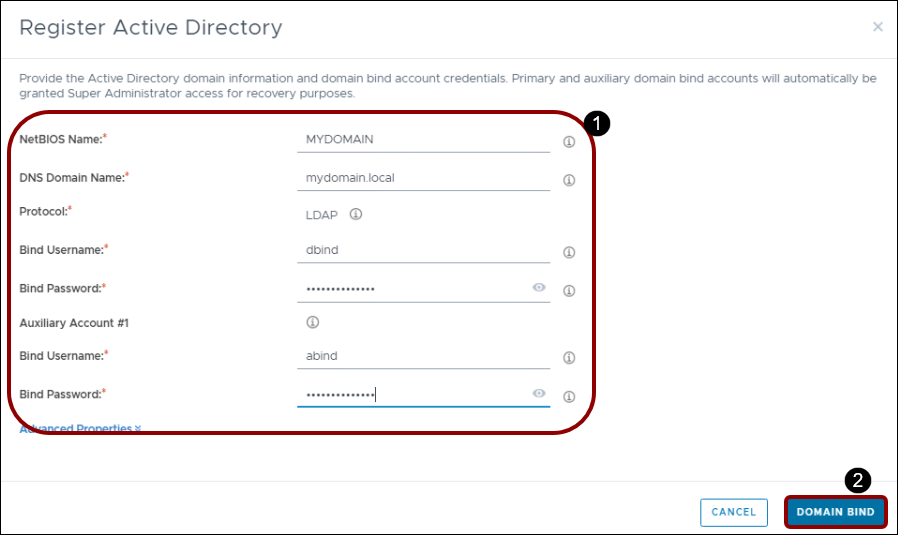

**Note:** After clicking on **DOMAIN BIND** button, there might be a delay of few seconds for the Domain Join Details page to appear. Please do not click on **DOMAIN BIND** button again in the mean time.


### **Task 4: Provide Domain Join Details**

1. After configuration is complete, in the Domain Join window, provide the required data.

   - **Primary DNS Server IP:** **<inject key="DNS Server IP" />**
   
   - **Secondary DNS Server IP (Optional):** Leave blank

   - **Default OU**: **<inject key="Horizon OU path" />**
   
   - **Join Username:** **<inject key="Domain Join Account" />**

   - **Join Password:** **<inject key="All Account Password" />**

2. In the lower right corner, click on **SAVE**.

   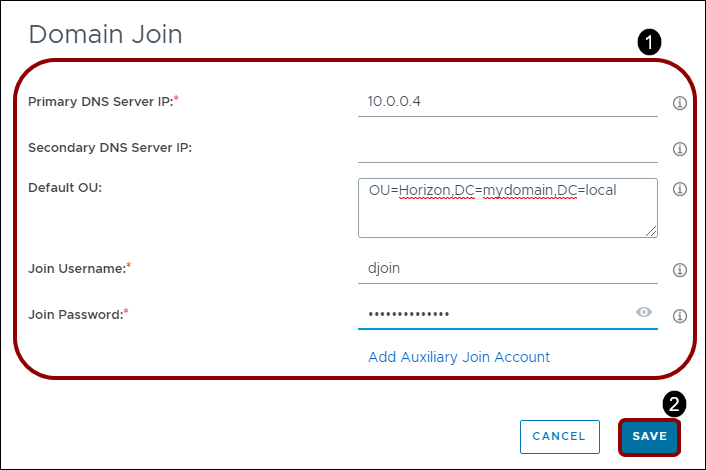

### **Task 5: Add the Administrator**
   
1. In the Add Administrator window, search for **Horizon Admins** and select that User Group.

2. In the lower right corner, click **Save**.

**Note:** The Active Directory group that includes the domain-join account, as described in the prerequisites. This action grants this group permissions to perform management actions in the Administration Console.

   

### **Task 6: Notice Change in Login Windows**

1. When you finish registering the pod with your Active Directory domain, the system returns you to the login window. Copy and paste the VMware account username and password that we copied earlier in the notepad, and click on **Login**.

   

2. Now login window will ask you to login using the Active Directory credentials. Enter the following values:

   - Username: **<inject key="Ad VM Admin UserName" />**
   
   - Password:**<inject key="Ad VM Admin Password" />**

   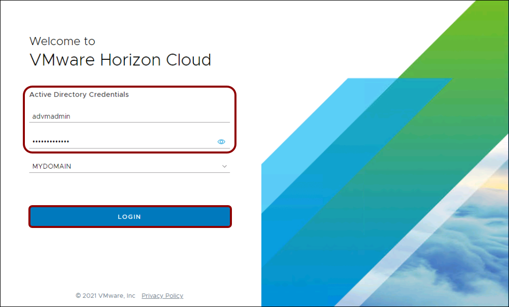

3. In the login window, you must log back in, first with your My VMware account, and then with the Active Directory credentials in the group that you just assigned.

   


### **Task 7: Join the VMware Customer Experience Improvement Program**

**Note**: Once you login back to Horizon Cloud service portal after deploying the pod and completing the bind operation, we may be prompted with a popup to choose whether or not to join the VMware Customer Experience Improvement Program(CEIP). Move the slider to **Yes**, and click on **Save**.

   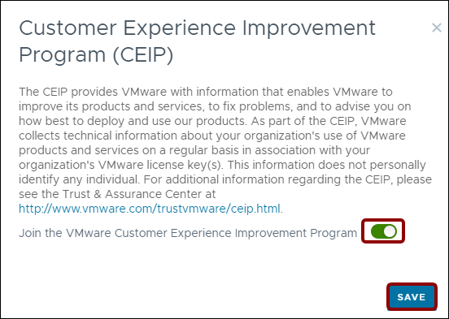

For more information, see [_VMware Horizon Cloud Service on Microsoft Azure Administration Guide_](https://docs.vmware.com/en/VMware-Horizon-Cloud-Service/index.html), and search the guide for **Register Your First Active Directory Domain**.

### **Task 8: Extend Session Timeout for Horizon Portal**

1. In VMware Horizon dashboard expand **Settings** and select **General Settings**.

2. Now click on the edit icon next to **Session Timeout**.

   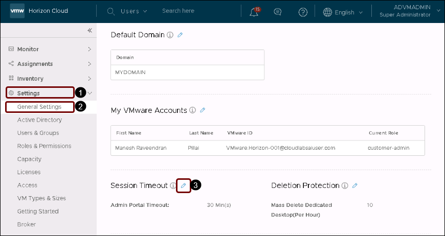

3. If the value of Admin portal Timeout is **180**, no action is needed. Else, change the value to **180** and click on **SAVE**.

   


## **Exercise 1.3: Create Broker**

1. Expand **Settings** pane, click on **Broker**.

**Note:** A precreated broker might already exist. In that case skip to Exercise 1.4, else continue with the steps below. 

2. Click on **Select**.

   

3. In FQDN section, enter following values:

   - Type: **VMware Provided**
   
   - Subdomain: Enter a unique name for subdomain.
   
   - Broker URL: This will get created when you will add Subdomain name.
   
   - Click on **NEXT**.

   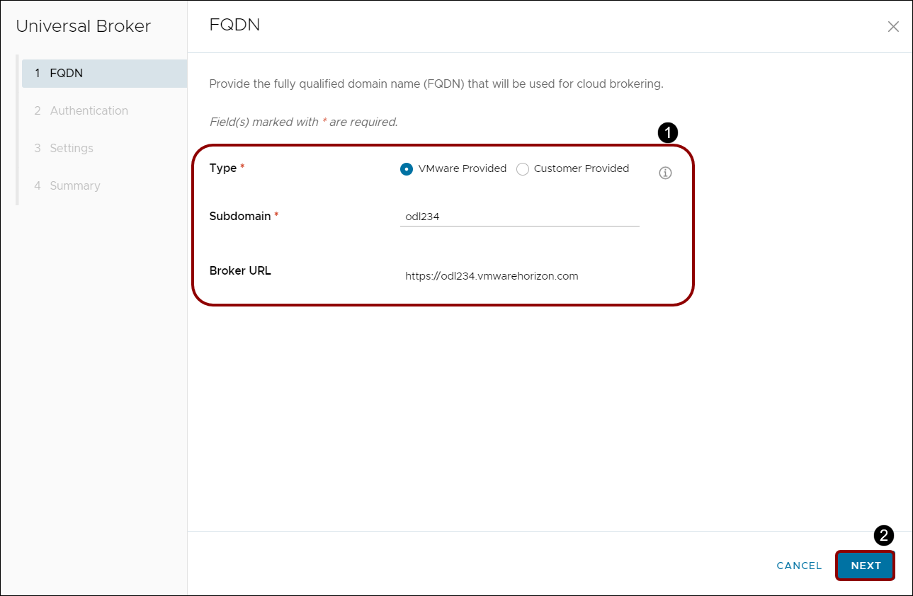

4. In Authentication section, leave all configurations on default and click on **Next**.

   

5. In Settings section, leave all configurations on default and click on **Next**.

   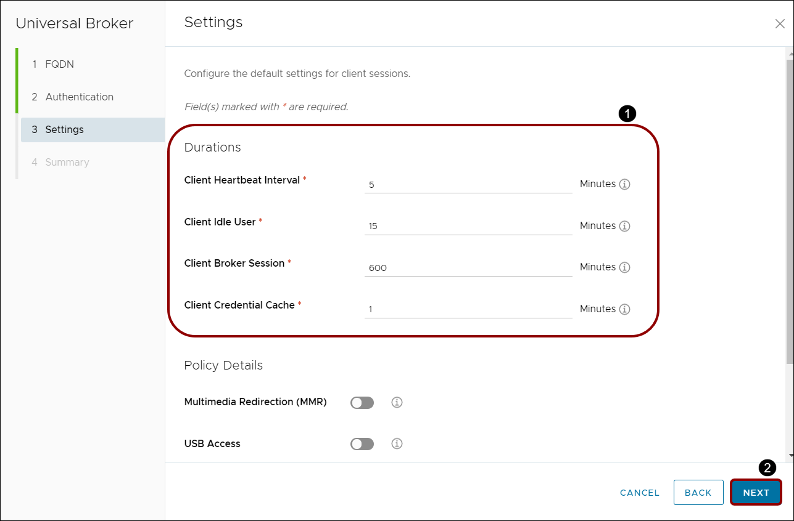

6. Review the Summary section and click on **Finish**.

   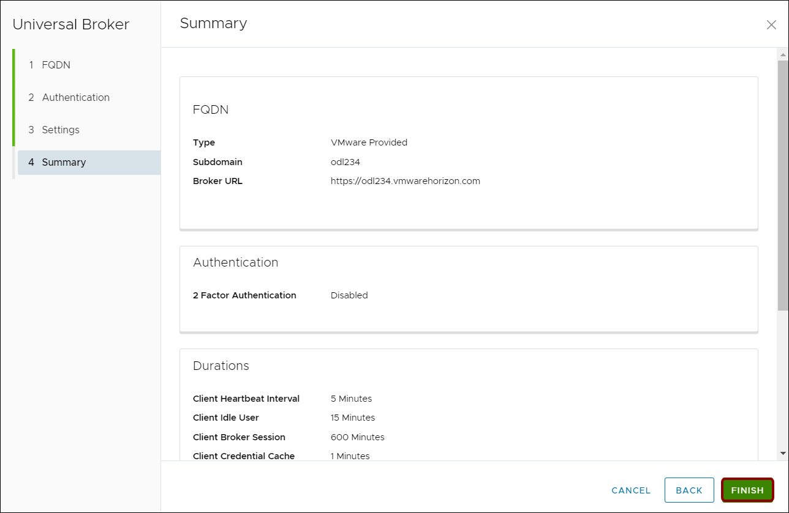

## **Exercise 1.4: Defining VM Types & Sizes**

You can optionally select which VM types and sizes to allow, add sizes to favorites, and customize how VM names are displayed.

Microsoft supports a wide variety of VM types and sizes, which you can learn about at [_Sizes for Windows virtual machines in Azure_](https://docs.microsoft.com/en-us/azure/virtual-machines/windows/sizes). Instead of reviewing the entire list of available VM types, you can save time by creating your own sub-set of your favorite types and sizes. You can create this sub-set during deployment, and you can update it at any time afterward. If you set the option to choose your VM type, your end users can review the sub-set and quickly make their selection.

For more information, see General Purpose virtual machine sizes.

### **Task 1: Navigate to VM Types & Sizes**

1. In Horizon Cloud, navigate to **Settings**.

2. Under Settings, select **VM Types & Sizes**.

3. Scroll through the long list of available settings.

   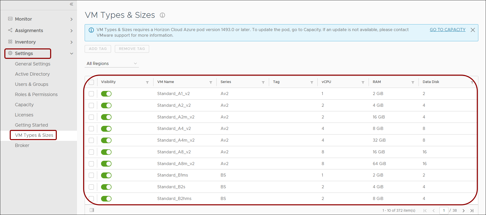

### **Task 2: Add a Tag**

1. From the list of available VM types, select a any size for which you want and click on **ADD TAG**.

   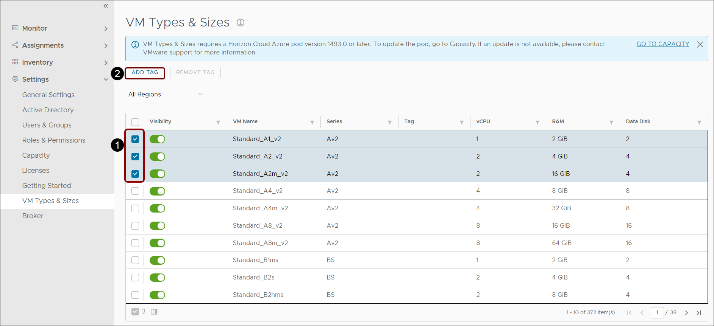

2. In the _Enter tags_ window type **Do Not Use** and click on **ADD**..

   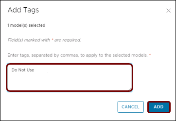

3. Make sure to use only letters, numbers, and spaces. As you can see, the use of an apostrophe is not allowed.

### **Task 3: Verify Success**

1. At the top of the VM Types & Sizes window, look for the banner that verifies success.

   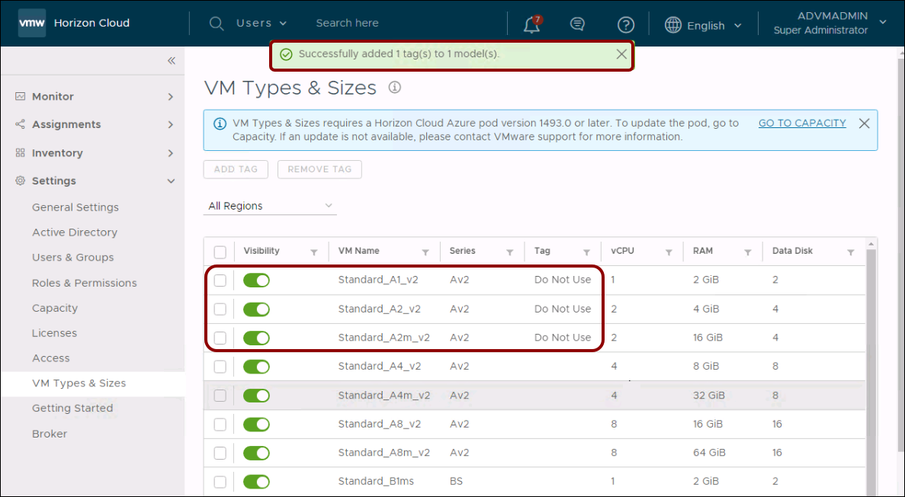

For more information, see [_VMware Horizon Cloud Service on Microsoft Azure Administration Guide](https://docs.vmware.com/en/VMware-Horizon-Cloud-Service/index.html), and search the guide for **Managing VM Types and Sizes for Farms and Assignments**.

After you finish creating and defining the subset of VM types and sizes that you want, you are ready to proceed to create a new image in the next exercise.


Click on the **Next** button from lower right corner of the guide to move on the next page.
