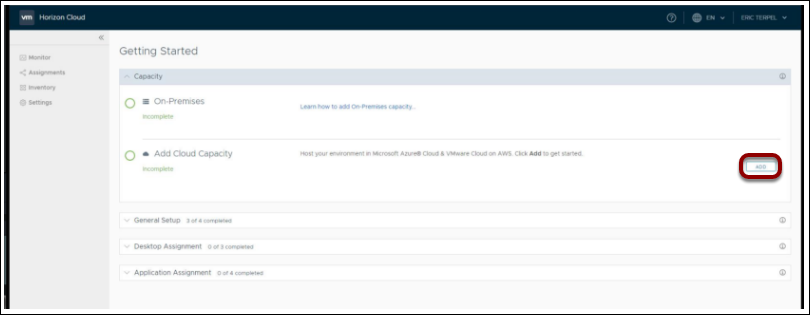
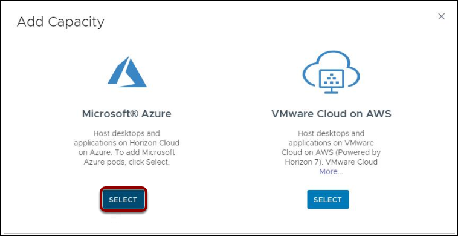
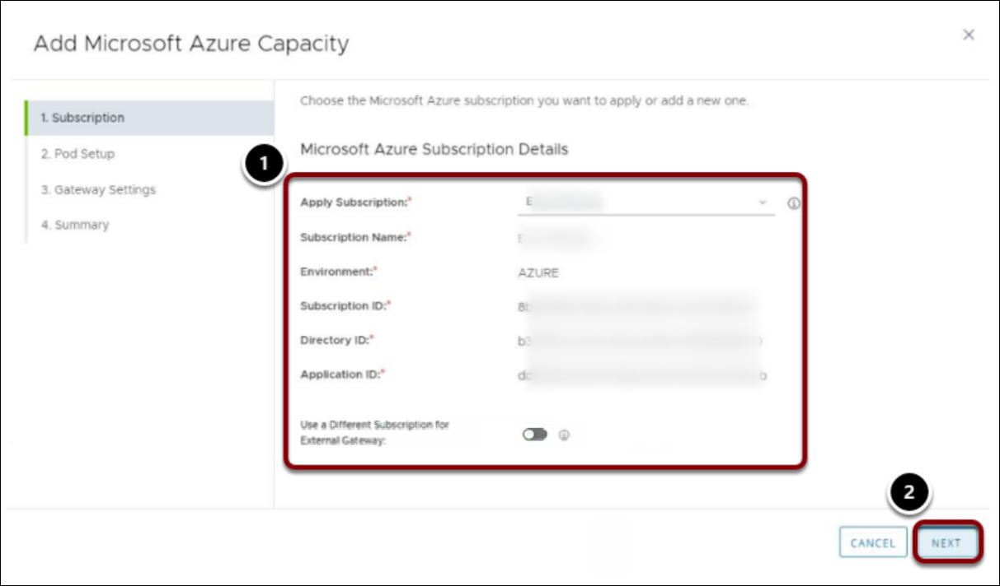
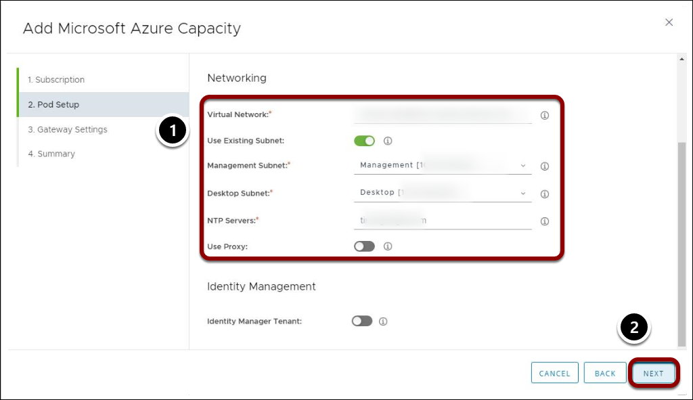
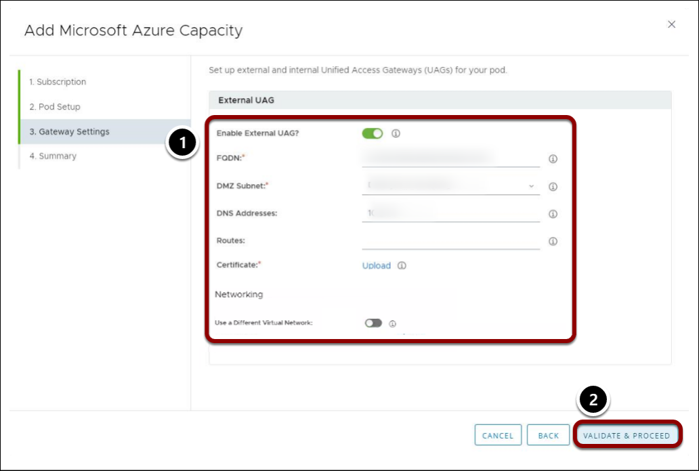
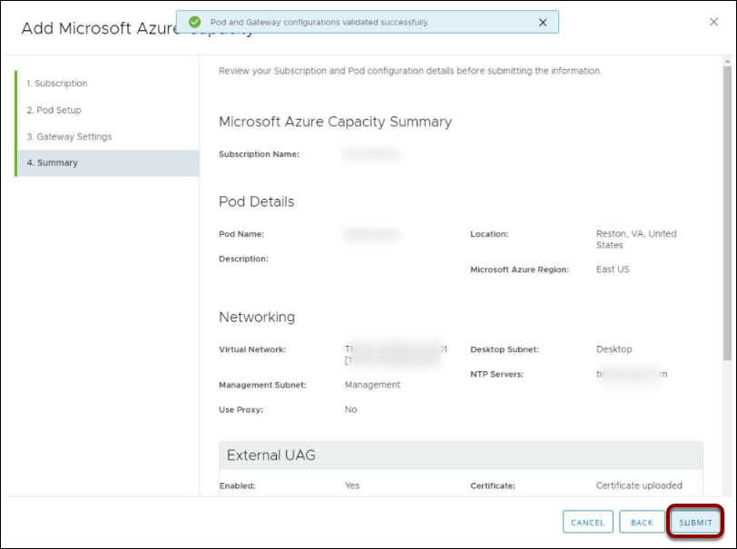
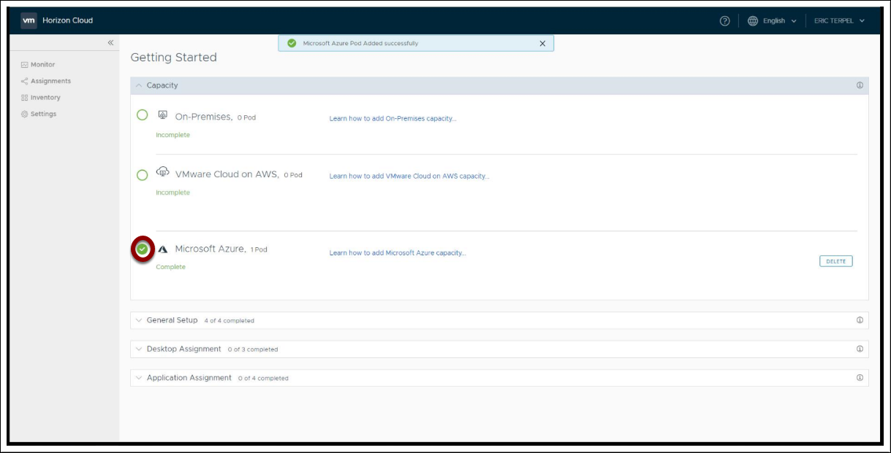

# B: Deploying a Horizon Cloud Service Pod

**About Pod Deployment**
Now that you have set up the Horizon Cloud Service on Microsoft Azure pod, you are ready to begin the initial configuration process of your deployment. In this series of exercises, you deploy a Horizon Cloud Service pod and bind it to an existing Active Directory domain. This grants the Horizon Cloud Service control plane access to create and manage resources in Microsoft Azure. These exercises are sequential and build upon one another, so make sure to complete each exercise in this section before going to the next.


## **Exercise B1: Deploying the Horizon Cloud Service Pod**

Armed with the prerequisite information from your Microsoft Azure tenant, you are now ready to begin deploying the Horizon Cloud Service pod and binding it to an existing Active Directory domain.

Use your My VMware credentials, which give you access to the Horizon Cloud Service control plane.
Before you deploy the Horizon Cloud Service pod, verify that you have the prerequisite information from your Microsoft Azure tenant, which the Horizon Cloud Service deployment wizard uses during the deployment process:
Service Principal: Like a certificate, the service principal object defines the policy and permissions for use of an application in a specific tenant, and is used to grant Horizon Cloud Service permission to access and modify your Microsoft Azure tenant
Subscription ID: Primary Microsoft Azure billing identifier based on your agreement with Microsoft
Directory ID: Your Primary Identifier or Identifiers in Microsoft Azure Active Directory
Application ID: An attribute of the Service Principal that securely ties the Horizon Cloud Service control plane to your Microsoft Azure subscription and is used to authorize Horizon Cloud as an application to use your Microsoft Azure capacity
Application Key: A one-time-use password that is used to encrypt the service principal
For more information, see Getting Started with VMware Horizon Cloud Service on Microsoft Azure(```https://docs.vmware.com/en/VMware-Horizon-Cloud-Service/services/hzncloudmsazure.getstarted15/GUID-6E460805-C323-4200-9A45-45E7BFB31730.html```).

1. Log in to VMware Horizon Cloud Service

   

  - Log in to Horizon Cloud Service, using your My VMware account ID and password.


2. Add a New Horizon Cloud Service Pod

   

  - In an account with no pods previously deployed, the Getting Started wizard defaults to the Capacity section. In the upper right corner of the Add Cloud Capacity pane, click Add, which starts the Horizon Cloud Service Pod Deployment wizard.
  - Note: To add a new Microsoft Azure pod to an account with pods previously deployed, you can alternatively click Settings > Capacity > New > Pod > Microsoft Azure.


3. Add Microsoft Azure Capacity

   

  - In the Add Capacity window, select Microsoft Azure. Adding capacity is equivalent to deploying a pod in a capacity environment and connecting that pod to your overall Horizon Cloud environment.

4. Provide Subscription Details

   

  1. In the Microsoft Azure Subscription tab of the Add Cloud Capacity window, provide the data that you gathered earlier:
    - Apply Subscription: Select Add New and enter the new subscription information.
    - Subscription Name: Enter a recognizable name to distinguish this subscription from others. The name must start with a letter and contain only letters, numbers, and dashes.
    - Environment: Select the environment associated with your Microsoft Azure subscription.
    - Subscription ID: Enter the subscription ID in UUID form, from the Subscription area of your Microsoft Azure portal.
    - Directory ID: Enter the Microsoft Azure AD Directory ID in UUID form, from the Microsoft Azure Active Directory properties in your Microsoft Azure portal.
    - Application ID: Enter the application ID in UUID form associated with the service principal you created in the Microsoft Azure portal. Creating an application registration and associated service principal in your Microsoft Azure Active Directory was a prerequisite. The application registration is used to authorize Horizon Cloud as an application to use your Microsoft Azure capacity.
    - Application Key: Enter the key value for the client secret of the service principal that you created in the Microsoft Azure portal. Creating this client secret was a prerequisite.
    - Use a Different Subscription for External Gateway: Accept the default and leave this option disabled.

  2. In the lower right corner, click Next.

5. Provide Pod Setup Details

   

  1. In the Details panel of the Pod Setup tab, provide the following information:
    - Pod Name: Enter a recognizable name, to be used in the Administration Console to distinguish this pod from other pods.
    - Location: Click Add to specify a location, which you can use to group pods according to categories that you provide, such as Business Unit A, Business Unit B, and so on. As you enter a city name, it should auto-populate. If your city name is not recognized, it will not be placed correctly on the Dashboard map. In this case, select the closest city available.
    - Microsoft Azure Region: Select the physical geographic Microsoft Azure region into which you want the pod to be deployed. For best performance, deploy the Horizon Cloud Service pod in a region that is geographically near the end users consuming the service to provide lower latency.
    - Description: Enter an optional description for this pod.

  2. Scroll down to the next panel.


6. Provide Networking Details

   

  1. In the Networking panel of the Work Setup tab, provide the following information:
    - Virtual Network: Select a virtual network from the list. Only virtual networks that exist in the region selected in the Microsoft Azure Region field are shown here. You must have already created the VNet you want to use in that region in your Microsoft Azure subscription.
    - Use Existing Subnet: Slide to enable, as in this example.
    - Management Subnet: Enter a subnet (in CIDR notation) to which the pod and Unified Access Gateway instances get connected, such as 192.168.8.0/28. For the management subnet, a CIDR of at least /28 is required.
    - Desktop Subnet: Enter the subnet (in CIDR notation) to which all of this pod's RDSH servers for end-user remote desktops and applications get connected, such as 192.168.12.0/22. Minimum: /28. Recommended: /22.
    - NTP Servers: Enter the list of NTP servers to use for time synchronization, separated by commas (for example 10.11.12.13, time.example.com).
    - Use Proxy: Slide to enable, or leave disabled as in this example.

  2. In the Identity Management panel, accept the default, and click Next.

7. Provide Unified Access Gateway Details

   

  1. In the Unified Access Gateway panel of the Work Setup tab, provide the following information.
    - Enable External UAG? Slide to enable, as in this example.
    - Internet Enabled Desktops: Select Yes to enable users located outside your corporate network to access desktops and applications. The pod includes a load balancer and Unified Access Gateway instances to enable this access. Selecting Internet-enabled desktops triggers Horizon Cloud Service to automatically deploy two Unified Access Gateway appliances in an availability setting.
    - FQDN: Enter the required fully qualified domain name (FQDN), such as ourOrg.example.com, for your end users to use to access the service. You must own that domain name and have a certificate in PEM format that can validate that FQDN.
    - DMZ Subnet: Enter the subnet in CIDR notation for the demilitarized zone (DMZ) network to be configured to connect the Unified Access Gateway instances to the load balancer.
    - DMZ Addresses: Accept default.
    - Route: Leave blank.
    - Certificate: Upload the certificate in PEM format for Unified Access Gateway to use to allow clients to trust connections to the Unified Access Gateway instances running in Microsoft Azure. The certificate must be based on the FQDN you entered and be signed by a trusted CA. A certificate is automatically applied to the two Unified Access Gateway appliances during deployment.
    - Use a Different Virtual Network: Accept the default and leave this option disabled.

  2. For this exercise, leave the two-factor identification settings disabled, and in the lower right corner, click Validate & Proceed.


8. Review Summary

   

  - Review the summary, verify that the information is correct and complete, and then click Submit.

9. Verify That the Pod Is Deployed

   

  - Wait until the green check mark appears, which indicates that the Horizon Cloud Service pod and all supporting infrastructure components are deployed. This process can take awhile to complete.

After you finish deploying the Horizon Cloud Service pod, proceed to the next exercise to perform the domain bind operation.


## **Exercise B2: Binding to the Active Directory Domain**

Machine creation and domain join operations are automated by Horizon Cloud Service. The domain bind operation must be performed on the pod before creating images and farms. You have several Active Directory domain configurations to choose from. For more information about these options, see Getting Started with VMware Horizon Cloud Service on Microsoft Azure(```https://docs.vmware.com/en/VMware-Horizon-Cloud-Service/index.html```).


