# Exercise 3: Deploying a Farm

## About Farm Deployment

A farm is a collection of Microsoft Remote Desktop Services (RDS servers) on Microsoft Azure that host applications and desktops. Farms simplify RDS host management because you can use farms to serve multiple user subsets where the sizes of the subset vary, or the desktop or application requirements vary. Farms can provide session-based desktops and remote applications.

Ideally, you provide the resources that users need to do their jobs without delays, and at the same time, avoid the cost of unused resources that are powered on but sitting idle. Horizon Cloud Service provides power management capabilities for the Microsoft Azure servers so hosts are automatically powered hosts on and off and deallocated, as needed. The result is that farms can automatically scale out to the maximum size when necessary, and scale down to minimum size when not needed. This reduces cloud capacity costs, as well as computing costs for deallocated servers.

You set up these options in the Horizon Cloud Service farm profile when you first create the farm, and you can also modify the settings at any time afterward.

**Note:** For this set of exercises, you need a server image deployed.

## Exercise 3.1: Creating a Farm

When the new image has been published, you can use it to create farms.

### Task 1: Create a New Farm

   

1. In the navigation bar of Horizon Cloud Service Administration Console, select **Inventory**.

2. Select **Farms**.

3. In the Farms window, click **New**.

### Task 2: Provide General Settings

   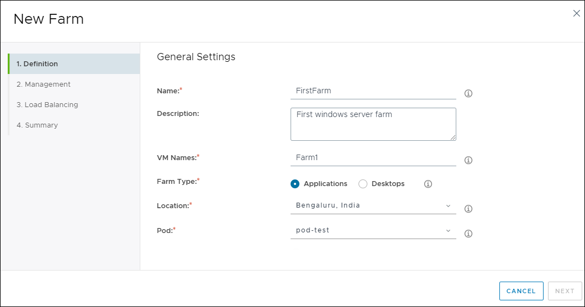

1. In the New Farm window, **Definition** tab, provide the following information, and then scroll down.
  
   - **Name:** Enter a name to help identify this farm in the system.

   - **Description:** Enter an optional description to help identify the farm in the system.

   - **VM Names:** Enter a name for all server VMs created for this farm to which a number is appended, such as win2016-1, win2016-2, and so on. The name must start with a letter and can contain only letters, dashes, and numbers.

   - **Farm Type:** Specify the type of asset this farm provides to end users. Keep this assignment time in mind when you select the server size, since desktop assignments may require more capacity.
   
      a. **Desktops:** Provides session-based desktops

      b. **Applications:** Provides access to remote applications
 
   - **Location:** Select the location from the list of pods in the pop-up menu.
 
   - **Pod:** Select the pod for this farm.
 
2. Scroll down to provide additional general settings.

### Task 3: Provide More General Settings

   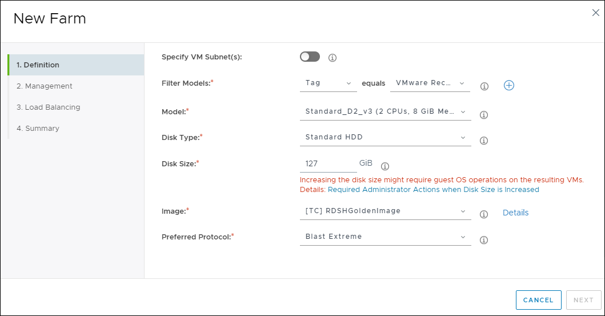

1. Provide the following additional general settings information:

  - **Filter Models:** You can filter the available VM models by type and favorites, and add filters as well.
  
  - **Model:** Select the Azure VM size for the Farm. Some VM sizes are not available in all regions.
  
  - **Disk Type:** Standard HDD
  
  - **Disk Size:** 127 GiB
  
  - **Image:** Select an available RDSH image from the list. Images that do not match the desktop model disk size are not displayed.
  
  - **Preferred Protocol:** Select either PCoIP or Blast as the default display protocol that you want the end-user sessions to use.

2. Scroll to the **Farm Size** section.

### Task 4: Set Farm Size

   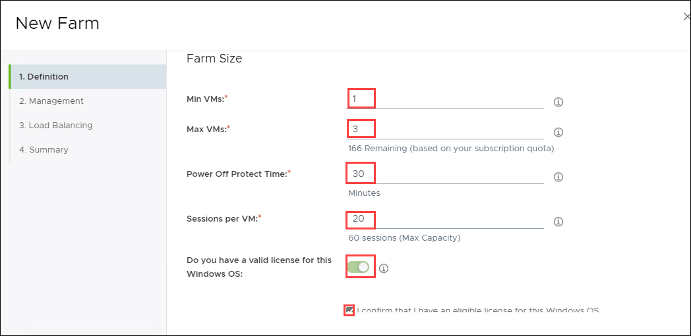

1. In the **Farm Size** pane, provide the information to enable the farm to automatically scale up or down on demand:
  - **Min Servers:** Specify the minimum number of usable servers in this farm so not all servers are running at the same time.
  - **Max Servers:** Specify the maximum number of servers that can exist at any one time so not all servers will be running at the same time.
  **Note:** The minimum number of server instances is initially powered on. As demand increases, additional servers are powered on until reaching the maximum. As end-user demand shrinks, servers are powered off until reaching the minimum. Each server is completely empty of user sessions before the system powers it off.
  - **Power Off Protect Time**: Accept the default of 30 minutes that a VM is protected from powering off after powering on due to a headroom error.
  - **Sessions per Server:** Specify the total number of sessions you want to allow per server.
  **Note:** This number cannot be updated after the farm is created.
  
2. **Do you have a valid license for this Windows OS:** Enable it and click on the check box saying **I confirm that I have an eligible license for this Windows OS.**

### Task 5: Provide Advanced Properties

   

1. Under **Advanced Properties**, provide the following information:

  - **Computer OU**: Enter the Active Directory Organizational Unit where the server VMs are to be located. For example, OU=RootOrgName,DC=DomainComponent,DC=eng, and so on. The entries must be comma-separated with no spaces in between.
  
  - **Run Once Script** (optional): You can enter the full executable path of a script that you want run after system preparation completes.

2. In the lower right corner, click **Next**.

### Task 6: Provide Rolling Maintenance Information

   

1. In the Management tab, provide the information for Rolling Maintenance.

   - **Maintenance Type:** Select the maintenance type, either according to:
   
      a. **Scheduled:** Select a time cadence such as daily or weekly.
      b. **Session:** Specify the number of user sessions at which the farm should begin rolling maintenance.
   
   - **Recurrence:** Indicate the type of recurrence.
   
   - **Recurrence Day:** Indicate the day of the week.
   
   - **Scheduled Hour:** Indicate the hour of the recurrence.
   
   - **Concurrent Quiescing Servers:** Indicate the number of concurrent quiescing servers.
   
   - **VM Action:** Select the action that the system should perform on servers that are undergoing maintenance:
   
      a. **Restart:** Restart the sever VMs.
      b. **Rebuild:** Delete server VMs and then re-provision them from their RDS desktop image.

2. Scroll to the Power Management panel.

### Task 7: Provide Power Management Information

   

1. In the Power Management panel, provide the information used to optimize the farm for your unique business needs. This is where you determine the thresholds at which new capacity is powered up or down, for automatic shutdown or deallocation of unused servers. Set the thresholds at which the system automatically grows and shrinks the number of powered-on server instances as it responds to demand and use:

  - **Optimized Performance:** Keeps more hosts powered on than are needed to service the current end-user workload. As more users log in, Horizon Cloud Service continues to power on hosts in advance, up to the threshold of the maximum farm size. This option increases capacity costs by having the next server ready before requested, but decreases the chance of a delay when users make the request.
  
  - **Optimized Power:** Waits as long as possible before powering on the next server instance, and more progressively deallocates unused hosts, leaving fewer available resources for end users. This option decreases capacity costs by using the servers longer before powering new ones, but increases the chance of a delay when users try to log in. You can even set the minimum number to 0, so all servers automatically power down when no users need them. However, the next users who log in experience a delay while the server powers back on, which might take several minutes.
  
  - **Balanced:** Strikes a 50:50 balance between optimizing for performance (time-to-availability for users), and optimizing for power (minimizing between capacity costs).

2. Scroll down to the Timeout Handling section.

### Task 8: Provide Timeout Handling Information

   

1. In the Timeout Handling panel, provide the required settings. This is where you configure how you want the system to handle different user session types.

  - **Empty Session Timeout:** Specify how to handle idle user sessions: never timeout idle sessions, or timeout after a specified number of minutes. **Note:** When a session is disconnected, the session is preserved in memory. When a session is logged out, the session is not preserved in memory, and any unsaved documents are lost.
  
  - **When Timeout Occurs:** Leave blank.
  
  - **Log Off Disconnected Sessions:** Specify when the system logs the user out of a disconnected session.
  
  - **Max Session Lifetime:** Specify the maximum number of minutes the system should allow for a single user session.
  
  - **Session Timeout Retrieval:** Leave blank.

2. Scroll down to Schedule Power Management.

### Task 9: Load Balancing Settings

   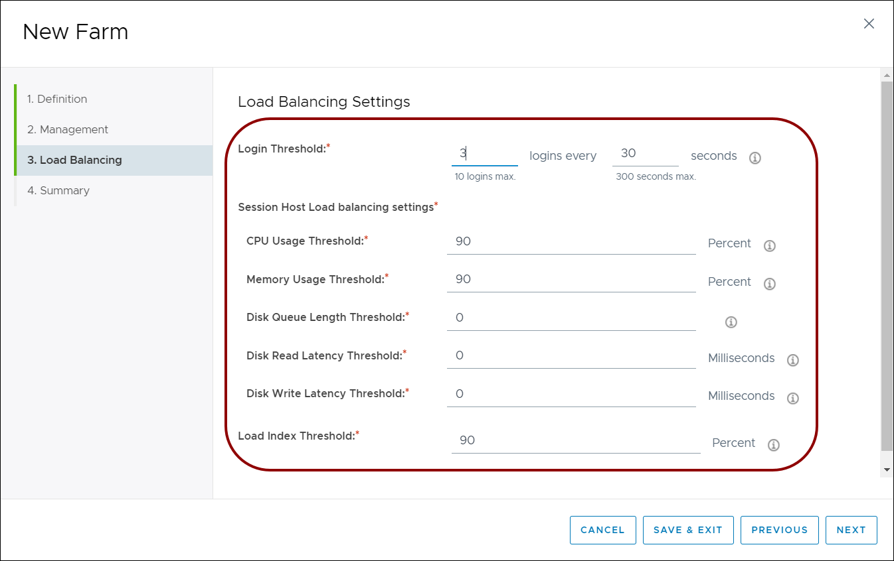

1. Under Schedule Power Management, click **Add a row**, and set the power management schedule:

  - **Login Threshold:** Provide a recognizable name for this schedule.
  
  - **CPU Usage Threshold:** Select the day or days of the week to run the schedule.
  
  - **Memory Usage Threshold:** Select a time of the day to start the schedule. You might need to scroll to see all options.
  
  - **Disk Queue Lenght Threshold:** Select the time of the day to end the schedule.
  
  - **Disk Read Latency Threshold:** Set the time zone if it differs from the default.
  
  - **Disk Write Latency Threshold:** Enter the minimum number of servers to include.
  
  - **Local Indes Threshold:**
   
2. In the lower right corner, click **Next**.

### Task 10: Verify the Summary Information

   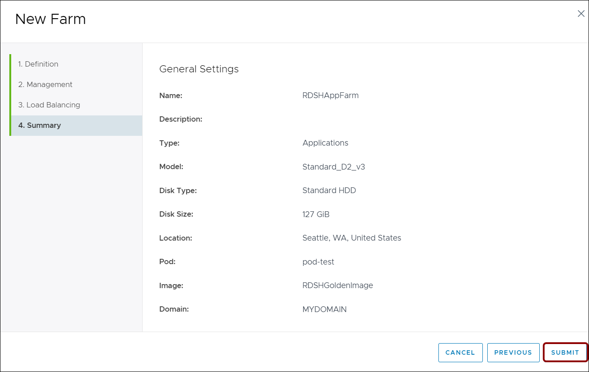

1. In the Summary tab, review all settings to verify they are correct and complete.

2. In the lower right corner, click **Submit**.

### Task 11: Verify in VMware Horizon Cloud Service

   

Under Status, verify that the green dot is displayed to indicate that the farm has been created properly.

For more information, see [VMware Horizon Cloud Service on Microsoft Azure Administration Guide](https://docs.vmware.com/en/VMware-Horizon-Cloud-Service/index.html), and search the guide for **Create a Farm**.

After you finish creating farms from the image, proceed to the next exercise to review RDS host power management.

## Exercise 3.2: Exploring RD Session Host Power Management

Horizon Cloud Service provides power management capabilities for the Microsoft Azure servers, automatically powering hosts on and off and deallocating them as needed. You can see the results of setting up the farm that you just created by returning to Microsoft Azure.

### Task 1: Verify in Microsoft Azure

1. Return to the Microsoft Azure portal.

   

2. Review the hosts that the farm automatically creates there.

### Task 2: Automatic Shutdown or Deallocation

   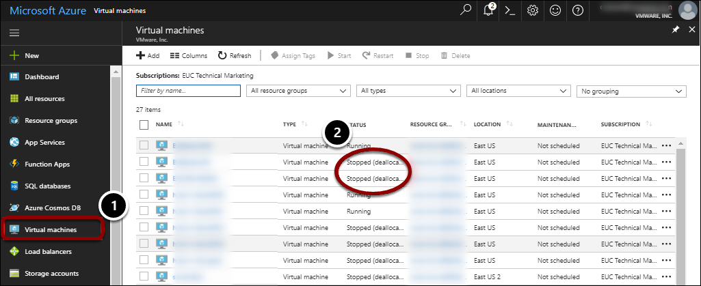
You can set up automatic shutdown or deallocation of unused servers. 

1. From the navigation bar, select **Virtual machines**.
2. View the status showing each subscription as running or automatically deallocated.

### Task 3: Automatic Creation of Resource Groups

   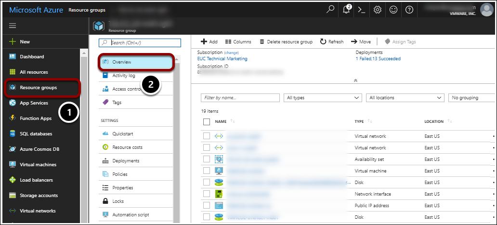
Horizon Cloud Service streamlines administration tasks, such as the automatic creation of resource groups, which contain all farm-related components. 

1. From the navigation bar, select **Resource groups**.

2. Click **Overview** to view resource group details.

### Task 4: Automatic Definition of Network Security Group Rules

   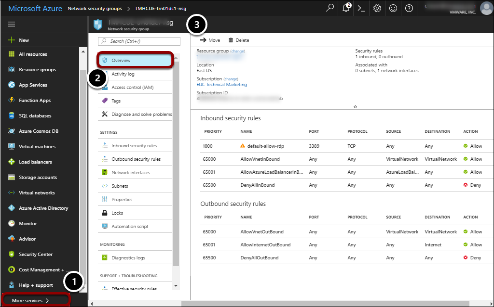
Network security group rules are automatically defined.

1. From the navigation bar, select **More services**.

2. Select **Network security groups**.

3. Select a group to view the security rules.

For more information, see [VMware Horizon Cloud Service on Microsoft Azure Administration Guide](https://docs.vmware.com/en/VMware-Horizon-Cloud-Service/index.html), and search the guide for **Applications in Your Horizon Cloud Inventory**.

After you finish reviewing RDS host power management, proceed to the next exercise to add applications from the farm.

## Exercise 3.3: Adding Applications from the Farm

Horizon Cloud Service can auto-discover applications installed on the farm, or you can manually specify an application. Select the applications to be published, and assign them to end users or groups.

### Task 1: Add New Applications

   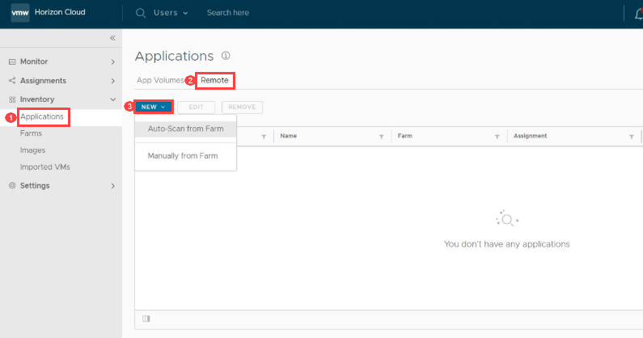

1. In the Horizon Cloud Service Administration Console click on **Applications** in navigation bar.

2. Then navigate to **Remote** tab and click on **New**.

### Task 2: Select Auto-Scan from Farm

   
   
Now click on **Auto-Scan from Farm**.

### Task 3: Provide Definition Information

   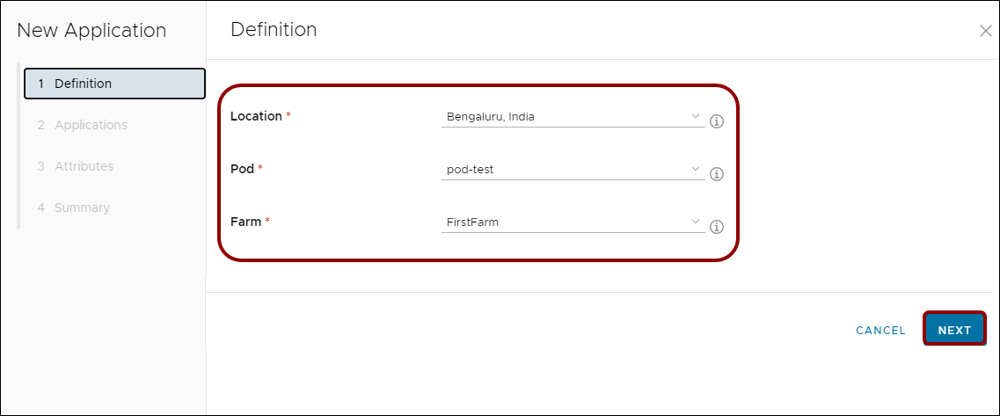

1. In the New Application window, click on the name of application fetched from scan.

2. Now fill the following details asked in the definetion page.

  - **Location:** Select a location from the pop-up menu.
  - **Pod:** Select the pod containing the farm you want to choose.
  - **Farm:** Select the farm.

2. In the lower right corner, click **Next**.

### Task 4: Select the Applications to Publish

   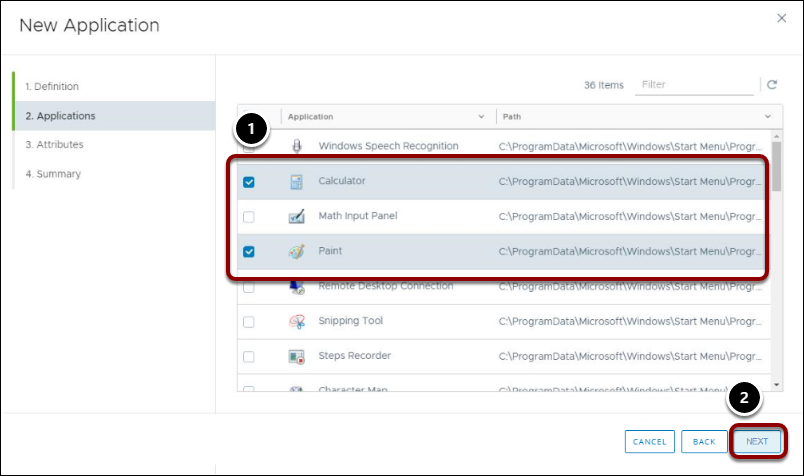

1. In the Applications tab, select the applications to be published.

2. In the lower right corner, click **Next**.

### Task 5: Provide Attributes

   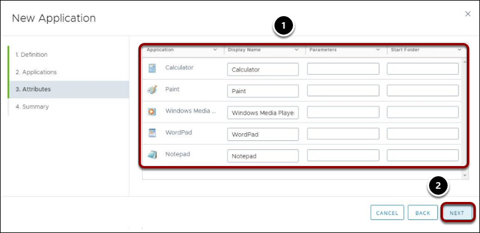

1. In the Attributes tab, provide the appropriate attributes.

2. In the lower right corner, click **Next**.

### Task 6: Verify the Summary Information

   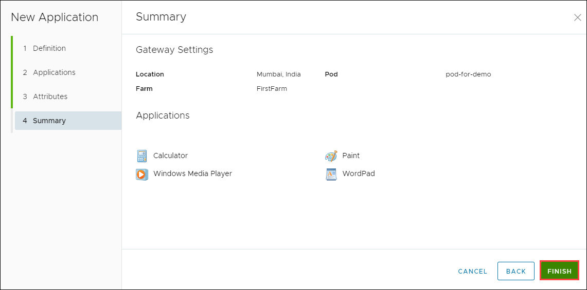

1. In the Summary tab, review to verify that the selections are correct and complete.
2. In the lower right corner, click **Finish**.

### Task 7: Verify Addition of New Applications

   

In the Applications window, the green banner verifies that the new applications were added successfully, and the green dots indicate that each application is active.

For more information, see [VMware Horizon Cloud Service on Microsoft Azure Administration Guide](https://docs.vmware.com/en/VMware-Horizon-Cloud-Service/index.html) and search the guide for **Importing New Applications from an RDSH Farm Using Auto-Scan from Farm**.

After you finish adding applications from the farm, proceed to the next section to explore assigning desktops and applications to users and groups.

Click on the **Next** button from lower right corner of the guide to move on the next page.
