# Exercise 4: Assigning Resources

## About Assignments

After you finish creating images and farms, you are ready to assign desktops and applications to users. There are three main types of assignments:

  - **Desktop Assignments** - You can use automation that is built into the system to perform basic VDI agent updates to floating and dedicated desktops. VDI desktops are powered off and deallocated when not in use, which reduces infrastructure costs. You can also leverage the system to support RDSH session desktops, to be accessed by remote users over a network connection. For more information about floating and dedicated desktop assignments, see [VMware Horizon Cloud May 2018 Release Technical What's New Overview](https://www.youtube.com/watch?t=2m56s&v=mSTBrUFFLDc&feature=youtu.be).
  - **Application Assignments** - You can assign Windows applications to users or groups using remote applications, which can be hosted on the RDS farms you created earlier. This enables you to provide the resources your users need when they need them, and avoids the cost of maintaining idle resources just waiting to be used.
  - **Customization** - You can customize your end user environments by making URL redirection assignments. You do this by configuring the client-to-agent URL redirection rules that tell the Horizon Client to redirect URLs from the end user's client machine to a desktop or application within your Horizon Cloud environment. For more information about customization, see *Assigning Customizations* in [Quick-Start Tutorial for VMware Horizon Cloud with Hosted Infrastructure](https://docs.vmware.com/en/VMware-Horizon-Cloud-Service/index.html).

## Exercise 4.1: Checking Desktop Capacity Allocation

Before you assign a desktop to a user or group, it is best practice to check the desktop capacity allocation.

### Task 1: Navigate to Dashboard

   

1. In the navigation bar on the left, click **Monitor**.
2. In the Monitor menu, click **Dashboard**.

### Task 2: Examine Utilization Data

   
   
1. Scroll down to the **Utilization** pane, and hover over the diagram. In this example, 7% of the allocated capacity is being used. Utilization is measured as follows:
  - **Horizon 7:** Average CPU, memory, and storage usage from vCenter(s) hosting connected Horizon 7 pods
  - **Microsoft Azure:** Desktop percentage is the number of connected to allocated desktops across Azure pods. Capacity percentage is number of allocated desktops.

2. In the bar graph, you can select and deselect metrics to hide data and enhance focus.

### Task 3: Navigate to Capacity Window

   
   
1. In the navigation bar on the left, select **Settings**.
2. In the Settings menu, click **Capacity**.
3. In the Capacity window, click on the pod you created.
4. Under Status, click the pod to see a detail summary.

### Task 4: View Capacity Allocation Details

   
   
1. Scroll down the Summary window to examine the capacity and utilization data:
  - **Capacity Utilization:** The number of desktops currently in use, divided by the number of desktops possible to use, tells you the capacity percentage by pod.
  - **Desktop & App Utilization:** The number of active sessions, divided by the number of sessions possible, provides you with a measure of user activity in terms of sessions in use, compared to maximum sessions possible.

2. Note the amount used so that you can compare after assigning the desktop.

For information about the capacity model, see [Service Description: VMware Horizon® Cloud Service™ on IBM Cloud](https://www.vmware.com/content/dam/digitalmarketing/vmware/en/pdf/support/vmware-horizon-cloud-hosted-service-description.pdf).

After verifying that the Desktop Capacity Allocation is sufficient, you can proceed to the next exercise to assign a desktop and see how the capacity allocation is affected.

## Exercise 4.2: Assigning Applications from the Farm

To assign applications to users and groups:

### Task 1: Assign New

   
   
1. In the navigation bar on the left, click **Settings**.
2. Under Settings, click **Getting Started**.
3. Under Desktop Assignment, to the right of Create New Desktop Assignment, click **New**.

### Task 2: Select Remote

   

  - In Create New Desktop Assignment, select **Session**.

### Task 3: Define Fixed and Felxible Attributes

   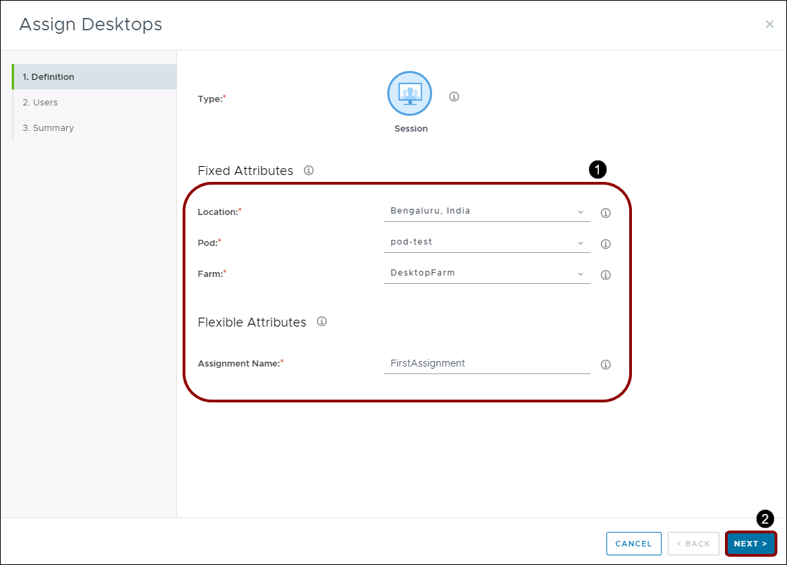
   
1. In the Definitions tab of the New Application Assignment window, select the Type.

2. Under Fixed Attributes, provide the following information:
  - **Location:** From the pop-up list, select the location.
  - **Pod:** From the pop-up list, select the pod containing the farm you want to choose.
  - **Farm:** Select **DesktopFarm** from the drop down.
  - **Assignment Name:** Under Flexible Attributes, give a name for assignment.
  
3. In the lower right, click **Next**.

### Task 4: Add Users

   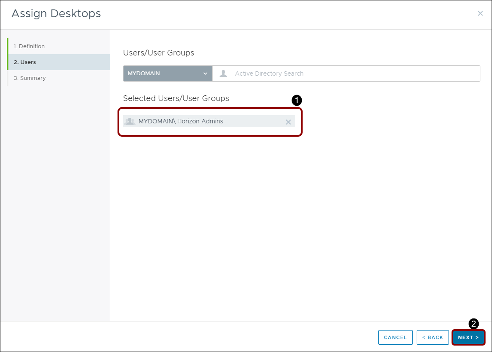
   
1. In the Users tab, search for **MYDOMAIN\Horizon** Admins groups and select it.
 
**Note:** You can click the **Active Directory** search field. If no results are found, click **Search Active Directory**.

2. In the lower right corner, click **Next**.

### Task 5: Configure Management

   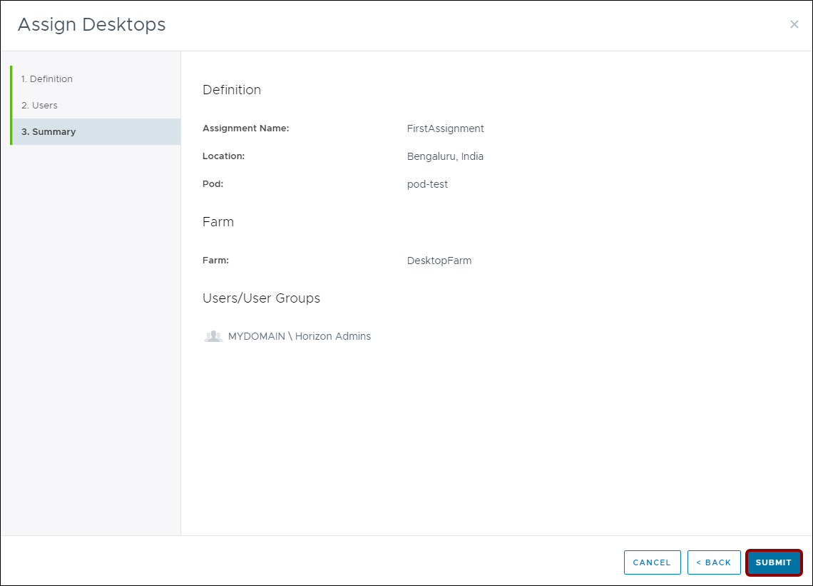
   
1. In the Summary tab, review and verify that your settings are correct and complete.
2. In the lower right corner, click **Submit**.

### Task 6: Verify Success

   
   
  - In the Getting Started window, verify that the success banner appears at the top.

### Task 7: Verify the Assignment

   
   
1. In the left-hand navigation bar, select **Assignments**.

2. Under Status, verify that the assignment displays a green dot, indicating that the assignment is now active.
For more information, see [Create a Remote Application Assignment](https://docs.vmware.com/en/VMware-Horizon-Cloud-Service/index.html).

When you finish assigning applications to user and groups, your end users can launch their assigned desktops and remote applications using your FQDN in either the Horizon Client or with HTML Access. You can proceed to the next exercise to create an RDSH session assignment.

## Exercise 4.3: Creating RDSH Session Assignments

To create a session desktop assignment, use the Assignments window after first verifying that your deployment meets the following prerequisites:

  - A farm is configured to deliver remote desktops
  - The intended farm is in the pod to deliver from
  - The intended farm is not already assigned

### Task 1: Assign New

   
   
1. In the navigation pane on the left, click **Assignments**.
2. In the Assignments window, click **New**.

### Task 2: Select Applications

   
   
In the New Assignment window, select **Desktops**.

### Task 3: Provide Fixed Attributes

   
   
1. In the Definition step under the Type pop-up menu, select **Remote**.

2. Under Fixed Attributes, provide the following information:
  - **Location:** Select the location of the pod where the session desktops should be provided.
  - **Pod:** Select the pod.

3. Under **Flexible Attributes**, enter the **Assignment Name**, a memorable name to help end users identify this assignment, using only letters, hyphens, and numbers.

4. In the lower right corner, click **Next**.

### Task 4: Select Applications

   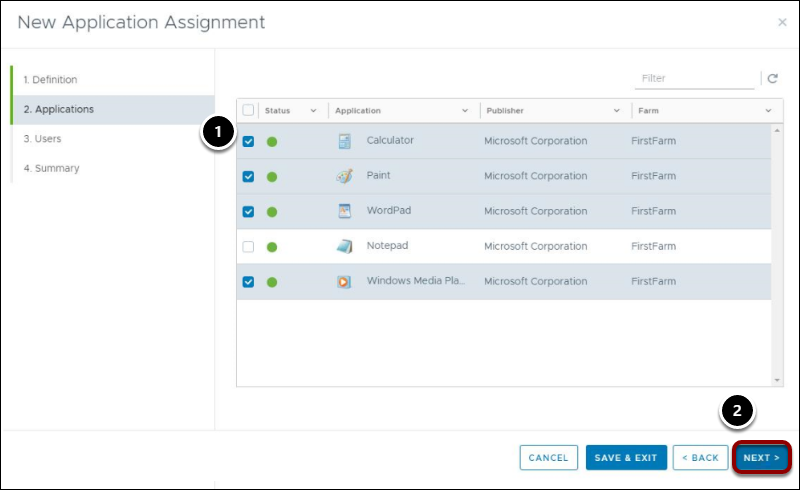
   
1. In the Applications tab, select the applications to add.

2. In the lower right, click **Next**.

### Task 5: Select Users and Groups

   
   
1. In the Users tab, search users and groups in your registered Active Directory domains and select the ones for this assignment.

2. In the lower right corner, click **Next**.

### Task 6: Verify the Summary

   
   
1. In the Summary tab, review the configuration summary.
2. In the lower right corner, click **Submit**.

### Task 7: Verify in the Assignments Window

   
   
1. Verify that the success banner appears at the top.
2. Wait while the system configures the farm's server instances to provide session desktops to the selected users. The green dot indicates that the assignment is active.

For more information, see [VMware Horizon Cloud Service on Microsoft Azure Administration Guide](https://docs.vmware.com/en/VMware-Horizon-Cloud-Service/index.html).

When you finish assigning session-based desktops to users and groups, this exercise is complete. You can proceed to the next exercise to assign floating desktops.

## Exercise 4.4: Assigning Floating Desktops

You can choose which type of desktop to assign to a user or group in the Assignments window. You can use the Assignments window to create, edit, and delete an assignment, and update the agent software for any existing assignments. In this exercise, you assign floating desktops. With floating desktops, the user is assigned a desktop upon first login, and the desktop is recreated after the user logs off. Desktops are powered on or off according to the power management policy. For more information, see [VMware Horizon Cloud May 2018 Release Technical What's New Overview](https://www.youtube.com/watch?v=mSTBrUFFLDc&feature=youtu.be&t=2m56s).

### Task 1: Navigate to New Assignments

   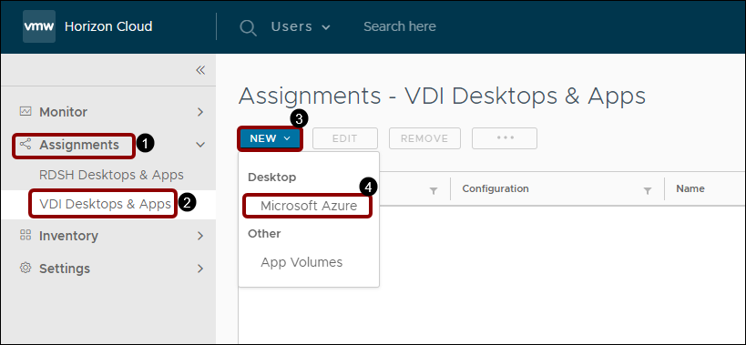

1. Expand **Assignments**.

2. Under Assignments pane, click on **VDI Desktops & Apps**.

3. Click on **New** and select **Microsoft Azure**.

### Task 2: Define Fixed Attributes

   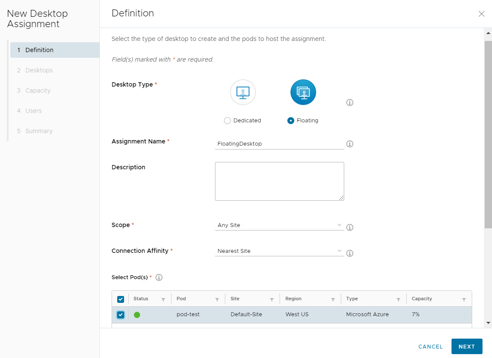
   
1. For **Type**, select **Floating**.
2. In the Fixed Attributes panel, provide the following information:
  - **Location:** From the pop-up list, select the location.
  - **Pod:** From the pop-up list, select the pod containing the farm you want to choose.
  - **Filter Models:** From the pop-up list, select the type and equals attributes.
  - **Model:** From the pop-up list, select the model.
  - **Domain:** From the pop-up list, select the domain name.
  - **Join Domain:** Slide to enable.
  - **Encrypt Disks:** Leave disabled.
  - **NSX Cloud Managed:** Leave disabled.
 
3. Scroll down to the next panel.

### Task 4: Define Flexible Attributes

   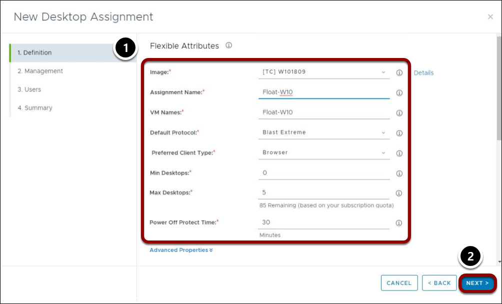
   
1. In the Flexible Attributes panel, provide the following information:
  - **Images:** Accept the image.
  - **Assignment Name:** Enter a friendly name to identify this assignment. The name must start with a letter, and contains only letters, dashes, and numbers.
  - **VM Names:** All VMs in this assignment inherit the assignment name, and include an appended number, such as Server DTAfloating 1, Server DTAfloating 2, and so on.
  - **Default Protocol:** From the pop-up list, select Blast Extreme as the default protocol for end user sessions.
  - **Preferred Client Types:** From the pop-up list, select **Browser**.
  - **Min Desktops:** Enter the minimum number of desktops to be allowed.
  - **Max Desktops:** Enter the maximum number of desktops to be allowed.
  - **Power Off Protect Time:** Enter the number of minutes.

2. In the lower right corner, click **Next**.

### Task 5: Configure Management

   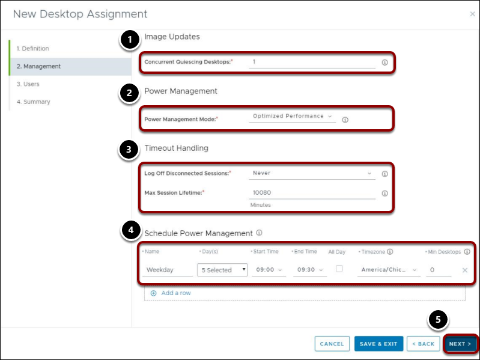
   
1. In the Management tab under **Image Updates**, enter the number of concurrent quiescing desktops to allow.
2. Under **Power Management**, select the mode from the pop-up list.
3. Under **Timeout Handling**, provide the following information:
  - **Log Off Disconnected Sessions:** Select **Never**.
  - **Max Session Lifetime:** Enter the number of minutes.
4. Under **Schedule Power Management**, provide the following information:
  - **Name:** Enter the name for this schedule.
  - **Day(s):** Click the Days field and select one or more days of the week from the drop-down list.
  - **Start Time:** Select the time of the day to start the schedule from the drop-down list.
  - **End Time:** Select the time of day to end the schedule from the drop-down list.
  - **All Day:** Leave unchecked.
  - **Timezone:** Select your timezone if necessary.
  - **Min Desktops:** Select the minimum number of desktops to include.

5. In the lower right corner, click **Next**.

### Task 6: Assign to Users or Groups

   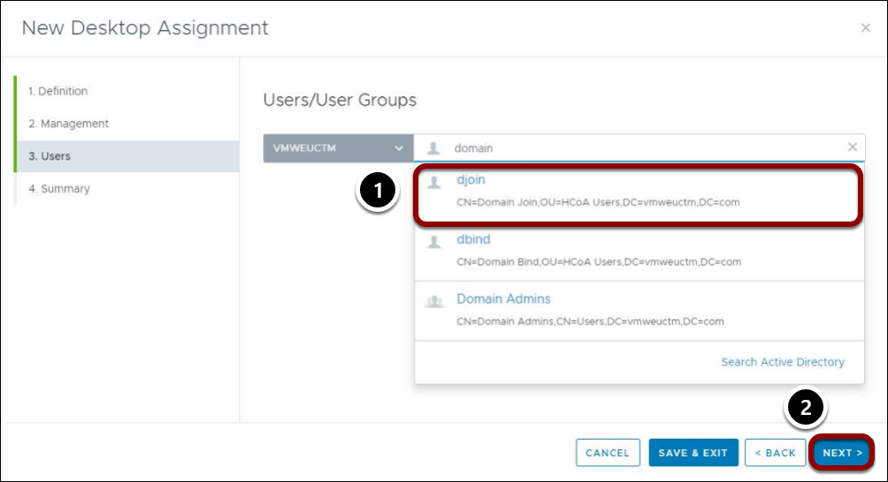
   
1. In the Users tab, select the users and groups to assign desktops to.
**Note:** In the Users tab, you can click the Active Directory search field. If no results are found, click **Search Active Directory**.

2. In the lower right, click **Next**.

### Task 7: Verify the Summary Information

   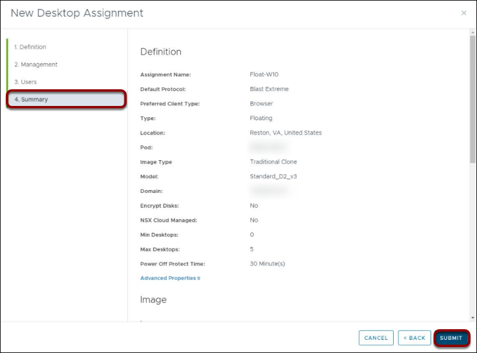
   
1. In the Summary tab, verify that all selections are correct and complete.

2. In the lower right corner, click **Submit**.

### Task 8: Verify Completion

   
   
1. Wait until the green banner appears at the top, indicating success.

2. Wait until the green dot appears in the Status column, indicating that the floating desktop assignment is now active.

### Task 9: Launch Horizon Client

   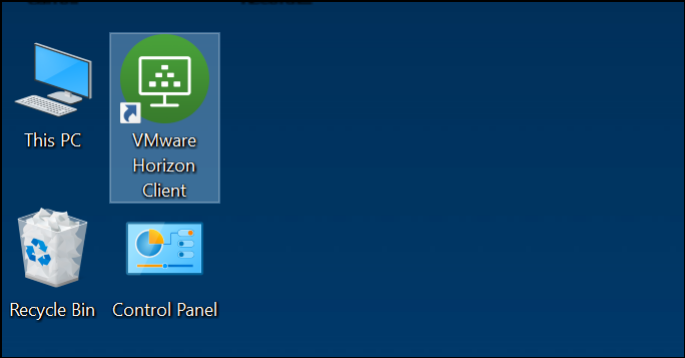
   
- Launch Horizon Client.

### Task 10: Log in to Horizon Client

   
   
1. Enter your login credentials for Horizon Client:
  - **Username:** Enter the username.
  - **Password:** Enter the password.
 
2. Click **Login**.

### Task 11: Launch the Floating Desktop

   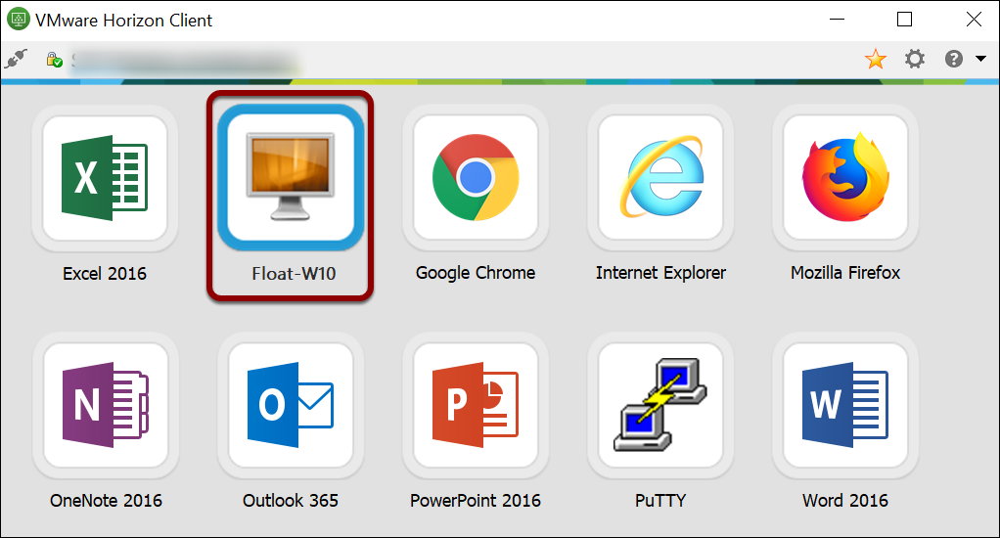
   
1. In Horizon Client, select a virtual desktop.

2. Verify that the virtual floating desktop launches properly.

For more information, see [VMware Horizon Cloud Service with Microsoft Azure Administration Guide](https://docs.vmware.com/en/VMware-Horizon-Cloud-Service/index.html), and search the guide for [Create a Floating VDI Desktop Assignment](https://techzone.vmware.com/&lpos=en%20:%20search%20results%20click%20:%20record-index%2014%20:%20page-index%201%20:%20d-type%20html?hWord=N4IghgNiBcIGIQPZgC4EsB2BzABAEwFMBnAaxUQAcQBfIA%20:%20GUID-DDBF3B88-5D03-4EB8-A3D6-628232873A4B%20:%2059&le=event3).

Now that you have successfully assigned a floating desktop, you can proceed to the next exercise to assign a VDI-based dedicated desktop. The process is very similar.

## Exercise 4.5: Assigning Dedicated Desktops

You use the Assignments window to create, edit, and delete assignments, choose which type of desktops to assign, and update the agent software for any existing assignments.

In this exercise, you assign a dedicated desktop. Your end-users are assigned a virtual desktop upon first login. They continue to get the same desktop whenever they log in subsequently, until or unless you rebuild the desktops. For more information, see [VMware Horizon Cloud May 2018 Release Technical What's New Overview](https://www.youtube.com/watch?t=2m56s&v=mSTBrUFFLDc&feature=youtu.be).

### Task 1: Navigate to New Assignments

   
   
1. In the navigation bar on the left, select **Assignments**.

2. In the Assignments window, click **New**.

### Task 2: Select Desktops

   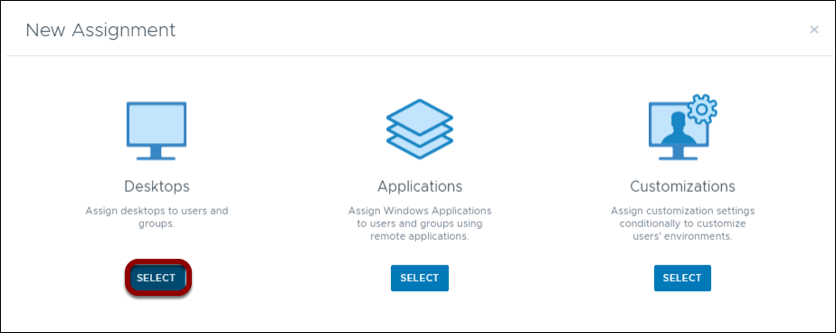
   
- In the New Assignment window under Desktops, click **Select**.

**Note:** To assign AppStacks or RDSH applications instead of desktops, you would select **Applications**.

### Task 3: Select a Dedicated Desktop Type

   
   
1. In the Definitions tab of the New Desktop Assignment window, for Type, select **Dedicated**.
Under Fixed Attributes, provide the following information:
  - **Location:** From the pop-up menu, select the location.
  - **Pod:** From the pop-up menu, select the pod.
  - **Filter Models:** In the first pop-up menu, select **Type**, and in the second, **VMware Recommended**.
  - **Model:** Select a **Desktop Model** from the pop-up menu.
  - **Domain:** From the pop-up menu, select the domain.
  - **Join Domain:** Slide right to enable.
  - **Encrypt Disks:** Leave disabled.
  - **NSX Cloud Managed:** Leave disabled.

3. Scroll down to the Flexible Attributes section.

### Task 4: Set the Flexible Attributes

   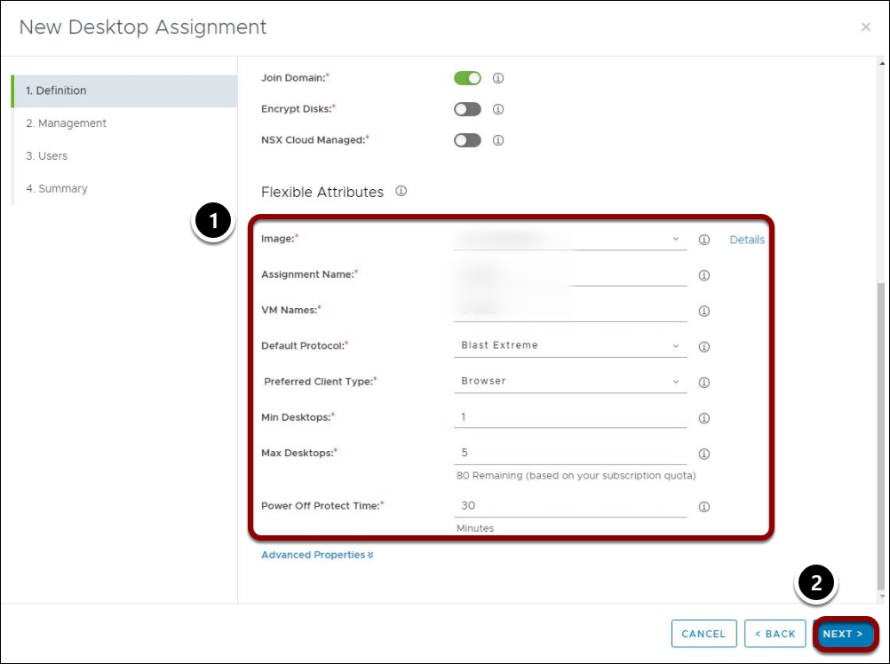
   
1. Under Flexible Attributes, provide the following information:
  - **Image:** Select the image from the pop-up menu.
  - **Assignment Name:** Enter a unique name to identify this assignment. The name must start with a letter, and contains only letters, dashes, and numbers.
  - **VM Names:** VMs in this assignment inherit the assignment name, and include an appended number, such as Server DTA1 1, Server DTA1 2, and so on.
  - **Default Protocol:** Choose **Blast Extreme** as the default protocol for end user sessions.
  - **Preferred Client Type:** Accept the browser default with which to launch assignments associated with this pool.
  - **Min Desktops:** Enter the minimum number of desktops to be allowed. In this example, it is 1.
  - **Max Desktops:** Enter the maximum number of desktops to be allowed. In this example, it is 5.

2. In the lower right corner, click **Next**.

### Task 5: Schedule Power Management

   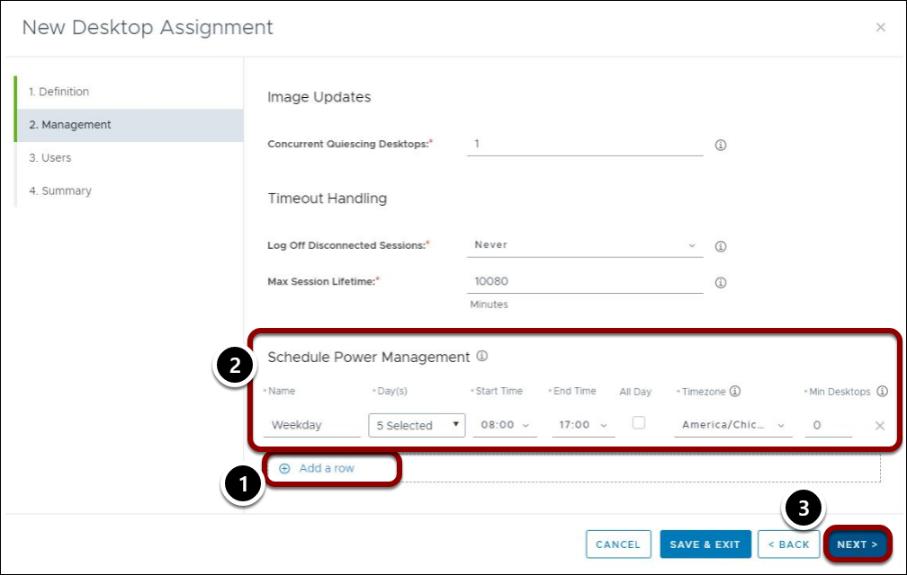
   
1. In the Management tab under Schedule Power Management, click **Add a row**.

2. Under Schedule Power Management, provide the following information:
  - **Name:** Provide a name for this schedule.
  -** Days:** Select one or more days of the week to schedule.
  - **Start Time:** Select a time of the day to start the schedule.
  - **End Time:** Select the time of the day to end the schedule.
  - **Timezone:** Select the appropriate time zone.
  - **Min Desktops:** Enter the minimum number of desktops to include.

3. In the lower right, click **Next**.

### Task 6: Select a User or Group

   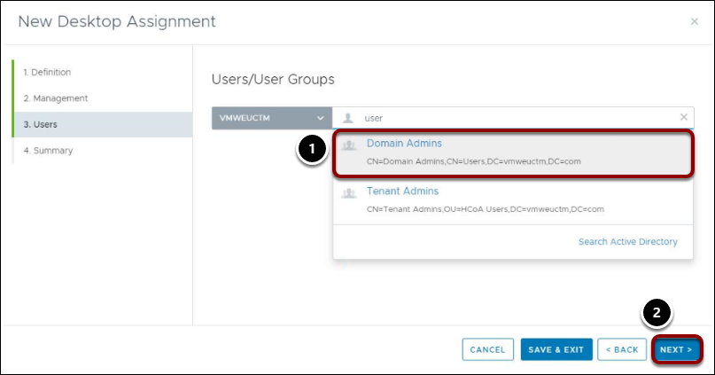
   
1. In the Users tab, select a user or group:
  - Click the Active Directory search field, and start entering the name of the user or group.
  - If you do not know the name, click **Search Active Directory** for a list of all names.
  - In the Active Directory hit list, select the name.

2. In the lower right corner, click **Next**.

### Task 7: Submit

   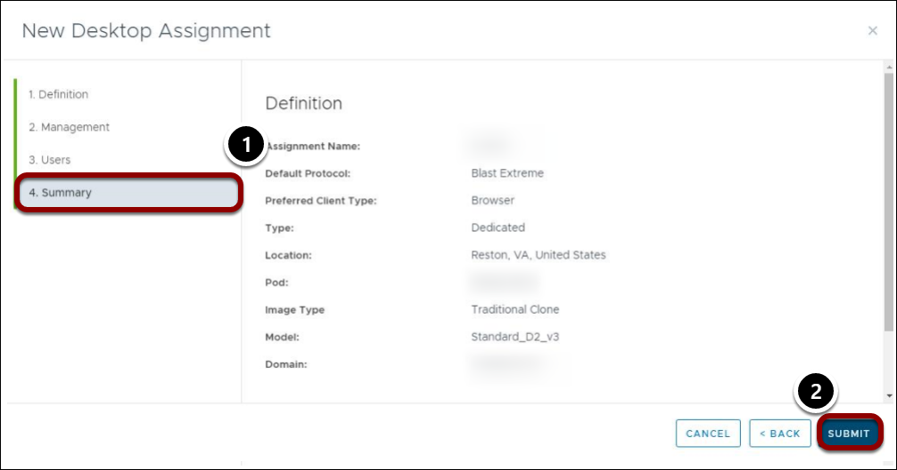
   
1. In the Summary tab, review the summary.

2. In the lower right corner, click Submit.   

### Task 8: Verify Completion

   
   
1. Verify that the success banner appears at the top of the window.

2. Wait until the green dot appears in the Status column, indicating that the new assignment is now active. This might take a few minutes.

### Task 9: Launch Horizon Client

   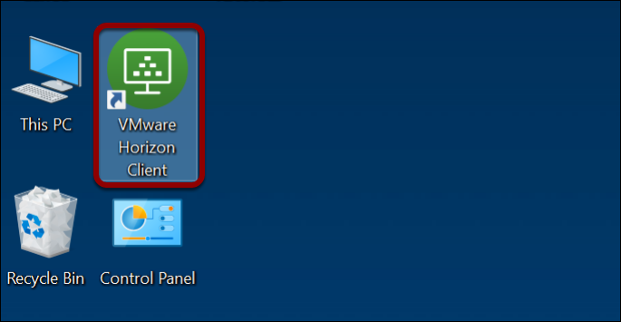
- Launch Horizon Client.

### Task 10: Log in to Horizon Client

   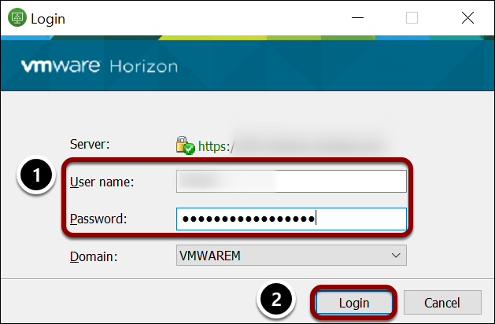
   
1. Enter your login credentials for Horizon Client:
  - **Username:** Enter the username.
  - Password: Enter the password.

2. **Click Login**.

### Task 11: Launch the Dedicated Desktop

   
   
  - In Horizon Client, launch the dedicated virtual desktop.

### Task 12: Verify Success

   

  - Verify that the virtual dedicated desktop launches properly.

  - When you finish assigning a dedicated desktop to a user or and group, you have completed the entire workflow. In the next two chapters, you can proceed to explore the Horizon Cloud Service monitoring and analytics features and the VMware Dynamic Environment Management capabilities in greater depth.
