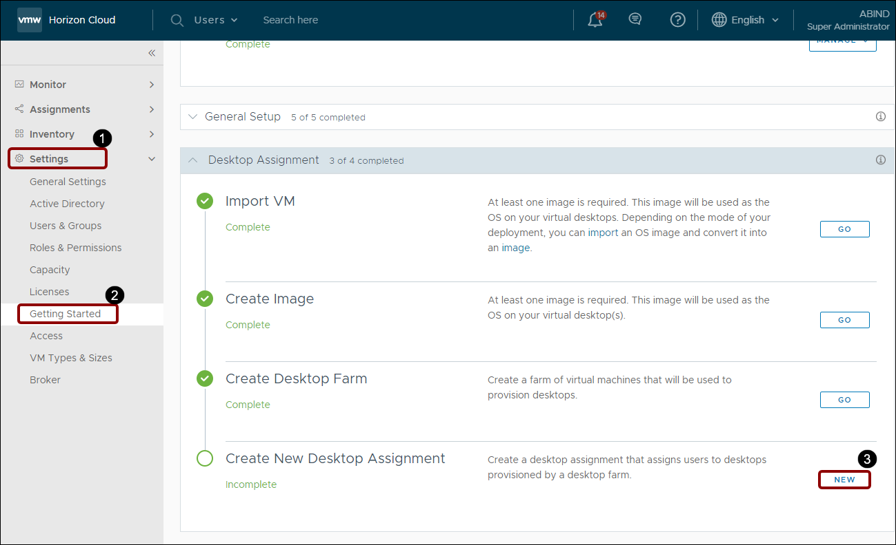
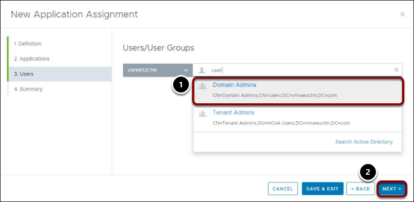
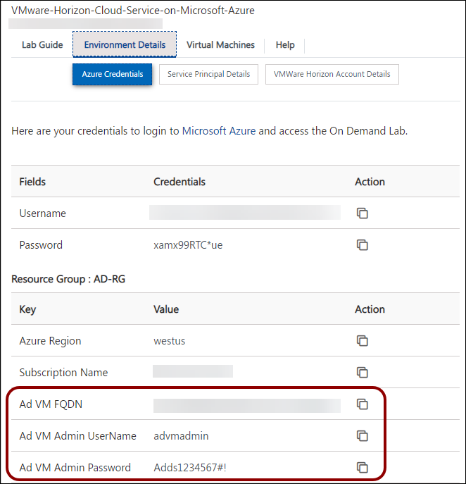
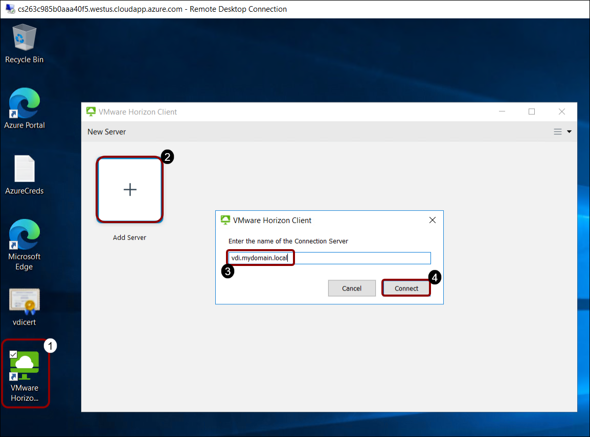
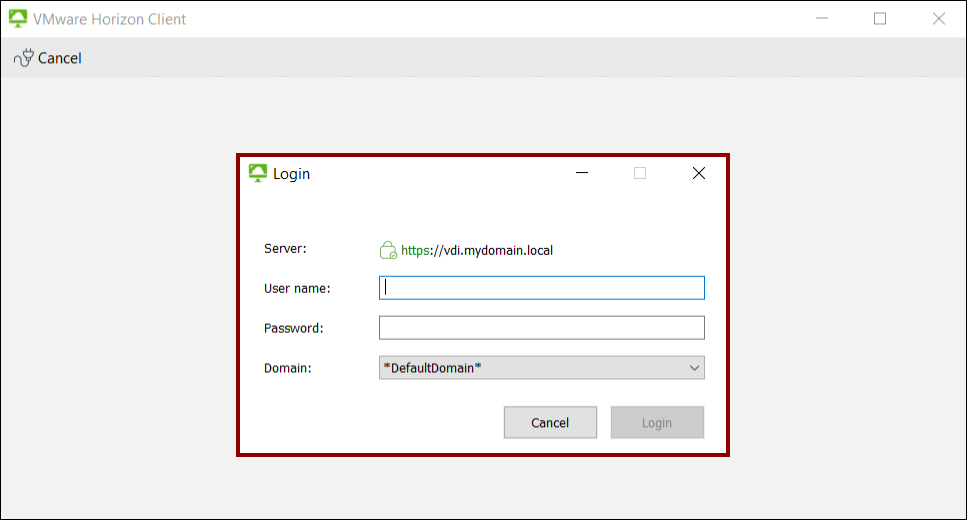
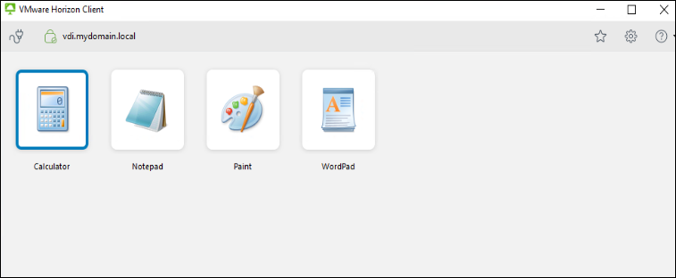
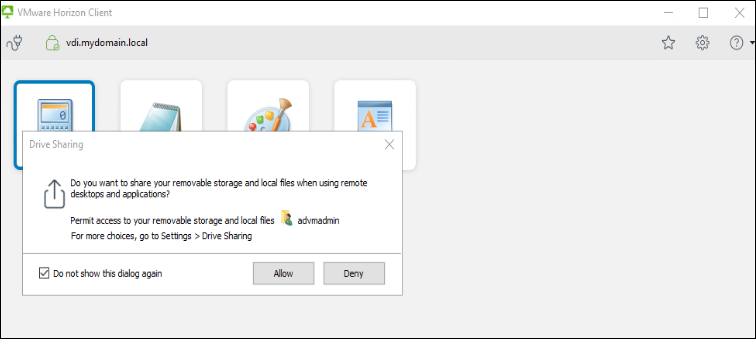

# Exercise 4: Assigning Resources

## About Assignments

After you finish creating images and farms, you are ready to assign desktops and applications to users. There are three main types of assignments:

  - **Desktop Assignments** - You can use automation that is built into the system to perform basic VDI agent updates to floating and dedicated desktops. VDI desktops are powered off and deallocated when not in use, which reduces infrastructure costs. You can also leverage the system to support RDSH session desktops, to be accessed by remote users over a network connection. For more information about floating and dedicated desktop assignments, see [VMware Horizon Cloud May 2018 Release Technical What's New Overview](https://www.youtube.com/watch?t=2m56s&v=mSTBrUFFLDc&feature=youtu.be).
  - **Application Assignments** - You can assign Windows applications to users or groups using remote applications, which can be hosted on the RDS farms you created earlier. This enables you to provide the resources your users need when they need them, and avoids the cost of maintaining idle resources just waiting to be used.
  - **Customization** - You can customize your end user environments by making URL redirection assignments. You do this by configuring the client-to-agent URL redirection rules that tell the Horizon Client to redirect URLs from the end user's client machine to a desktop or application within your Horizon Cloud environment. For more information about customization, see *Assigning Customizations* in [Quick-Start Tutorial for VMware Horizon Cloud with Hosted Infrastructure](https://docs.vmware.com/en/VMware-Horizon-Cloud-Service/index.html).

## Exercise 4.1: Checking Desktop Capacity Allocation

Before you assign a desktop to a user or group, it is best practice to check the desktop capacity allocation.

### Task 1: Navigate to Dashboard

   

1. In the navigation bar on the left, click **Monitor**.
2. In the Monitor menu, click **Dashboard**.

### Task 2: Examine Utilization Data

   
   
1. Scroll down to the **Utilization** pane, and hover over the diagram. In this example, 7% of the allocated capacity is being used. Utilization is measured as follows:
  - **Horizon 7:** Average CPU, memory, and storage usage from vCenter(s) hosting connected Horizon 7 pods
  - **Microsoft Azure:** Desktop percentage is the number of connected to allocated desktops across Azure pods. Capacity percentage is number of allocated desktops.

2. In the bar graph, you can select and deselect metrics to hide data and enhance focus.

### Task 3: Navigate to Capacity Window

   
   
1. In the navigation bar on the left, select **Settings**.
2. In the Settings menu, click **Capacity**.
3. In the Capacity window, click on the pod you created.
4. Under Status, click the pod to see a detail summary.

### Task 4: View Capacity Allocation Details

   
   
1. Scroll down the Summary window to examine the capacity and utilization data:
  - **Capacity Utilization:** The number of desktops currently in use, divided by the number of desktops possible to use, tells you the capacity percentage by pod.
  - **Desktop & App Utilization:** The number of active sessions, divided by the number of sessions possible, provides you with a measure of user activity in terms of sessions in use, compared to maximum sessions possible.

2. Note the amount used so that you can compare after assigning the desktop.

For information about the capacity model, see [Service Description: VMware Horizon® Cloud Service™ on IBM Cloud](https://www.vmware.com/content/dam/digitalmarketing/vmware/en/pdf/support/vmware-horizon-cloud-hosted-service-description.pdf).

After verifying that the Desktop Capacity Allocation is sufficient, you can proceed to the next exercise to assign a desktop and see how the capacity allocation is affected.

## Exercise 4.2: Assigning Applications from the Farm

To assign applications to users and groups:

### Task 1: Assign New

   
   
1. In the navigation bar on the left, click **Settings**.
2. Under Settings, click **Getting Started**.
3. Under Desktop Assignment, to the right of Create New Desktop Assignment, click **New**.

### Task 2: Select Remote

   

  - In Create New Desktop Assignment, select **Session**.

### Task 3: Define Fixed and Felxible Attributes

   
   
1. In the Definitions tab of the New Application Assignment window, select the Type.

2. Under Fixed Attributes, provide the following information:
  - **Location:** From the pop-up list, select the location.
  - **Pod:** From the pop-up list, select the pod containing the farm you want to choose.
  - **Farm:** Select **DesktopFarm** from the drop down.
  - **Assignment Name:** Under Flexible Attributes, give a name for assignment.
  
3. In the lower right, click **Next**.

### Task 4: Add Users

   
   
1. In the Users tab, search for **MYDOMAIN\Horizon** Admins groups and select it.
 
**Note:** You can click the **Active Directory** search field. If no results are found, click **Search Active Directory**.

2. In the lower right corner, click **Next**.

### Task 5: Configure Management

   
   
1. In the Summary tab, review and verify that your settings are correct and complete.
2. In the lower right corner, click **Submit**.

### Task 6: Verify Success

   
   
  - In the Getting Started window, verify that the success banner appears at the top.

### Task 7: Verify the Assignment

   
   
1. In the left-hand navigation bar, select **Assignments**.

2. Under Status, verify that the assignment displays a green dot, indicating that the assignment is now active.
For more information, see [Create a Remote Application Assignment](https://docs.vmware.com/en/VMware-Horizon-Cloud-Service/index.html).

When you finish assigning applications to user and groups, your end users can launch their assigned desktops and remote applications using your FQDN in either the Horizon Client or with HTML Access. You can proceed to the next exercise to create an RDSH session assignment.

## Exercise 4.3: Creating RDSH Session Assignments

To create a session desktop assignment, use the Assignments window after first verifying that your deployment meets the following prerequisites:

  - A farm is configured to deliver remote desktops
  - The intended farm is in the pod to deliver from
  - The intended farm is not already assigned

### Task 1: Assign New

   
   
1. In the navigation pane on the left, click **Assignments**.
2. In the Assignments window, click **New**.

### Task 2: Select Applications

   
   
In the New Assignment window, select **Desktops**.

### Task 3: Provide Fixed Attributes

   
   
1. In the Definition step under the Type pop-up menu, select **Remote**.

2. Under Fixed Attributes, provide the following information:
  - **Location:** Select the location of the pod where the session desktops should be provided.
  - **Pod:** Select the pod.

3. Under **Flexible Attributes**, enter the **Assignment Name**, a memorable name to help end users identify this assignment, using only letters, hyphens, and numbers.

4. In the lower right corner, click **Next**.

### Task 4: Select Applications

   
   
1. In the Applications tab, select the applications to add.

2. In the lower right, click **Next**.

### Task 5: Select Users and Groups

   
   
1. In the Users tab, search users and groups in your registered Active Directory domains and select the ones for this assignment.

2. In the lower right corner, click **Next**.

### Task 6: Verify the Summary

   
   
1. In the Summary tab, review the configuration summary.
2. In the lower right corner, click **Submit**.

### Task 7: Verify in the Assignments Window

   
   
1. Verify that the success banner appears at the top.
2. Wait while the system configures the farm's server instances to provide session desktops to the selected users. The green dot indicates that the assignment is active.

For more information, see [VMware Horizon Cloud Service on Microsoft Azure Administration Guide](https://docs.vmware.com/en/VMware-Horizon-Cloud-Service/index.html).

When you finish assigning session-based desktops to users and groups, this exercise is complete. You can proceed to the next exercise to assign floating desktops.

### Task 8: Launch Horizon Client to access the application

   

1. Connect to **AdVM** using credentials given in **Environment Details > Azure Credentials**: 

   

2. In AdVM, open **VMHorizon Client** given on the desktop. Double click on **Add Server**, then enter **vdi.mydomain.local** and click on **Connect**.

   

3. The login window will appear asking for username and password to connect to the server.

   

4. Enter following credentials:

  - Username: **vdiuser**
  
  - Password: **P@s#w0rdyu2nnk**
  
  - Domain: Leave on **DefaultDomain**
   
   

5. 

   

   

   

Click on the **Next** button from lower right corner of the guide to move on the next page.

