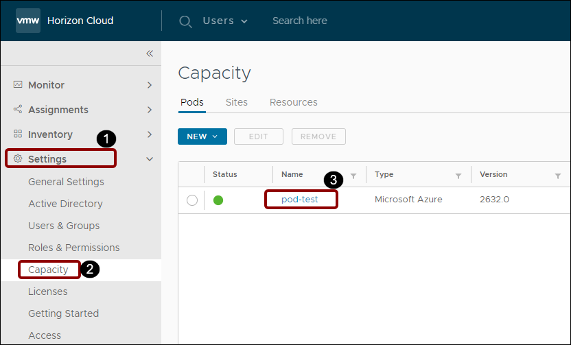
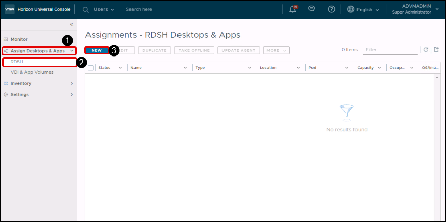
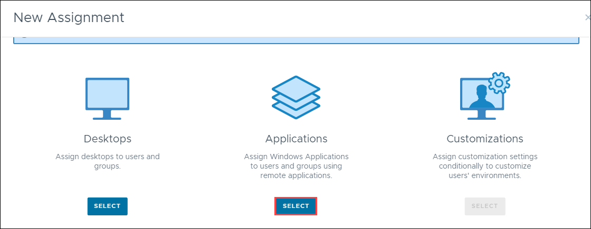
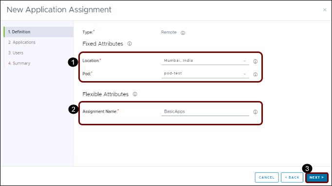
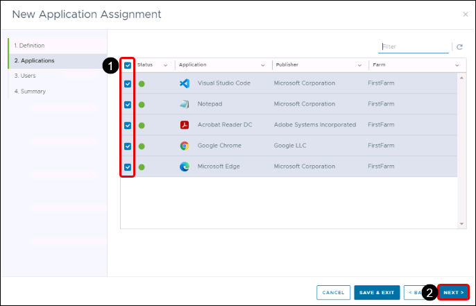
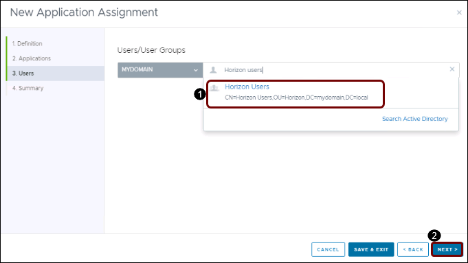
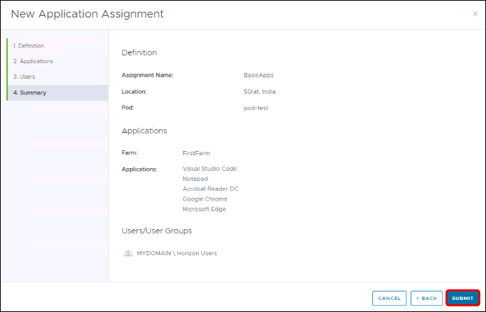
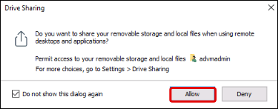
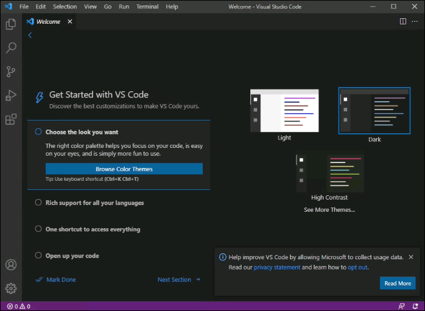

# **Exercise 4: Assigning Resources**

## About Assignments

After you finish creating images and farms, you are ready to assign desktops and applications to users. There are three main types of assignments:

  - **Desktop Assignments** - You can use automation that is built into the system to perform basic VDI agent updates to floating and dedicated desktops. VDI desktops are powered off and deallocated when not in use, which reduces infrastructure costs. You can also leverage the system to support RDSH session desktops, to be accessed by remote users over a network connection. For more information about floating and dedicated desktop assignments, see [VMware Horizon Cloud May 2018 Release Technical What's New Overview](https://www.youtube.com/watch?t=2m56s&v=mSTBrUFFLDc&feature=youtu.be).
  - **Application Assignments** - You can assign Windows applications to users or groups using remote applications, which can be hosted on the RDS farms you created earlier. This enables you to provide the resources your users need when they need them, and avoids the cost of maintaining idle resources just waiting to be used.
  - **Customization** - You can customize your end user environments by making URL redirection assignments. You do this by configuring the client-to-agent URL redirection rules that tell the Horizon Client to redirect URLs from the end user's client machine to a desktop or application within your Horizon Cloud environment. For more information about customization, see *Assigning Customizations* in [Quick-Start Tutorial for VMware Horizon Cloud with Hosted Infrastructure](https://docs.vmware.com/en/VMware-Horizon-Cloud-Service/index.html).

## **Exercise 4.1: Checking Desktop Capacity Allocation**

Before you assign a desktop to a user or group, it is best practice to check the desktop capacity allocation.

### **Task 1: Navigate to Dashboard**

1. In the navigation bar on the left, click **Monitor**.
2. In the Monitor menu, click **Dashboard**.

   

### **Task 2: Examine Utilization Data**
    
1. Scroll down to the **Utilization** pane, and hover over the diagram. In this example, 7% of the allocated capacity is being used. Utilization is measured as follows:
  - **Horizon:** Average CPU, memory, and storage usage from vCenter(s) hosting connected Horizon pods
  - **Microsoft Azure:** Desktop percentage is the number of connected to allocated desktops across Azure pods. Capacity percentage is number of allocated desktops.

2. In the bar graph, you can select and deselect metrics to hide data and enhance focus.

   

### **Task 3: Navigate to Capacity Window**
   
1. In the navigation bar on the left, select **Settings**.
2. In the Settings menu, click **Capacity**.
3. In the Capacity window, click on the pod you created.
4. Under Status, click the pod to see a detail summary.

    

### **Task 4: View Capacity Allocation Details**

   
   
1. Scroll down the Summary window to examine the capacity and utilization data:
  - **Capacity Utilization:** The number of desktops currently in use, divided by the number of desktops possible to use, tells you the capacity percentage by pod.
  - **Desktop & App Utilization:** The number of active sessions, divided by the number of sessions possible, provides you with a measure of user activity in terms of sessions in use, compared to maximum sessions possible.

2. Note the amount used so that you can compare after assigning the desktop.

After verifying that the Desktop Capacity Allocation is sufficient, you can proceed to the next exercise to assign a desktop and see how the capacity allocation is affected.

## **Exercise 4.2: Creating RDSH Session Assignments**

To create a session desktop assignment, use the Assignments window after first verifying that your deployment meets the following prerequisites:

  - A farm is configured to deliver remote desktops
  - The intended farm is in the pod to deliver from
  - The intended farm is not already assigned

### **Task 1: Assign New**

1. In the navigation pane on the left, click **Assign Desktops & Apps** and select **RDSH** from dropdown menu.
2. In the Assignments window, click **New**.

   

### **Task 2: Select Applications**

   
   
In the New Assignment window, select **Applications**.

### **Task 3: Provide Fixed Attributes**

1. Under Fixed Attributes, provide the following information:
  - **Location:** Select the location of the pod where the session desktops should be provided.
  - **Pod:** Select the pod.

2. Under **Flexible Attributes**, enter the **Assignment Name**, a memorable name to help end users identify this assignment, using only letters, hyphens, and numbers.

   

3. In the lower right corner, click **Next**.

### **Task 4: Select Applications**

1. In the Applications tab, select the applications to add.

   

2. In the lower right, click **Next**.

### **Task 5: Select Users and Groups**
   
1. In the Users tab, search **Horizon users** and select it for this assignment.

   

2. In the lower right corner, click **Next**.

### **Task 6: Verify the Summary**
   
1. In the Summary tab, review the configuration summary.

   

2. In the lower right corner, click **Submit**.

### **Task 7: Verify in the Assignments Window**
   
1. Wait while the system configures the farm's server instances to provide session desktops to the selected users. The green dot indicates that the assignment is active.

   

For more information, see [VMware Horizon Cloud Service on Microsoft Azure Administration Guide](https://docs.vmware.com/en/VMware-Horizon-Cloud-Service/index.html).

When you finish assigning session-based desktops to users and groups, this exercise is complete. You can proceed to the next exercise to assign floating desktops.

### **Task 8: Launch Horizon Client to access the application**

1. In AdVM, open **VMHorizon Client** given on the desktop. Double click on **Add Server**, then enter **vdi.mydomain.local** and click on **Connect**.
  
   
  
  >**Note:** If you are prompted with following warning then click on **Continue**.
  >
  >

2. The login window will appear asking for username and password to connect to the server.

  
  
  
3. Enter following credentials:

  - Username: **<inject key="vdi Username 1" props="{\&quot;enableCopy\&quot;:true,\&quot;style\&quot;:{\&quot;fontWeight\&quot;:\&quot;bold\&quot;}}" />**
  
  - Password: **<inject key="all Account Password" props="{\&quot;enableCopy\&quot;:true,\&quot;style\&quot;:{\&quot;fontWeight\&quot;:\&quot;bold\&quot;}}" />**
  
  - Domain: Leave on **DefaultDomain**

  
  
4. Double click on the Application we want to launch.

  
  
  
5. The Application will start loading.

  

6. If the prompt appears, click on **Allow**.

  
  
7. The Application will launch and will be ready to use.

   

>**Note:** Microsoft Office applications might not be usable as MS Office 365 License is not provided to the AD user used in the lab.

8. Close the Horizon Client.

Click on the **Next** button from lower right corner of the guide to move on the next page.

