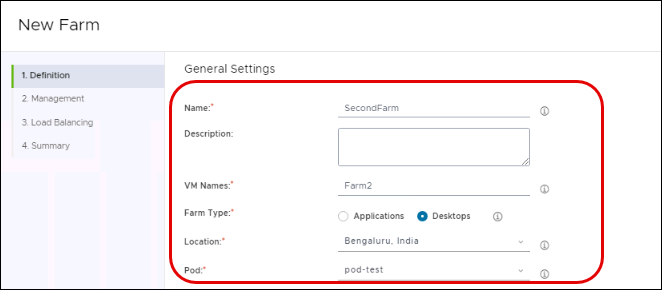
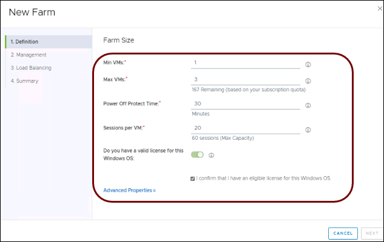
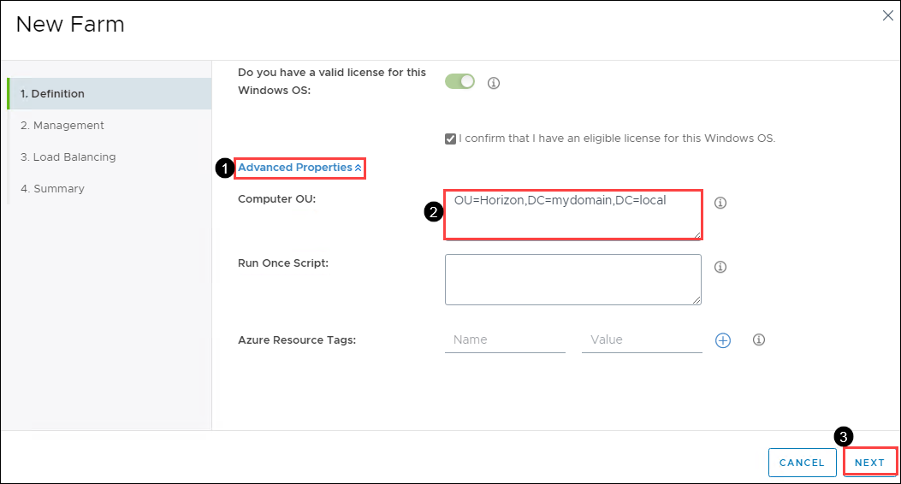
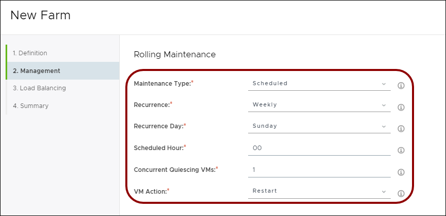
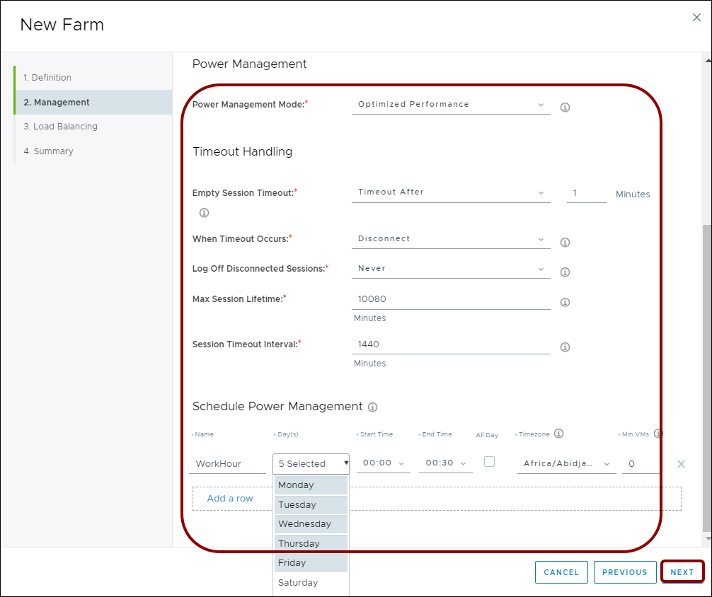

# **Exercise 5: Creating a Desktop Farm**

## **Exercise 5.1: Creating a Farm**

When the new image has been published, you can use it to create farms.

### **Task 1: Create a New Farm**

   

1. In the navigation bar of Horizon Cloud Service Administration Console, select **Inventory**.

2. Select **Farms**.

3. In the Farms window, click **New**.

### **Task 2: Provide General Settings**

   

1. In the New Farm window, **Definition** tab, provide the following information, and then scroll down.
  
   - **Name:** **SecondFarm**

   - **Description:** Enter an optional description to help identify the farm in the system.

   - **VM Names:** **Farm2**

   - **Farm Type:** Select **Desktops**
   
      a. **Desktops:** Provides session-based desktops, b. **Applications:** Provides access to remote applications
 
   - **Location:** Select the location in which you created pod in Exercise 1.
 
   - **Pod:** Select **pod-test**.
 
2. Scroll down to provide additional general settings.

### **Task 3: Provide More General Settings**

   

1. Provide the following additional general settings information:

  - **Specify VM Subnet(s):** Toggle off the switch.

  - **Filter Models:** From first drop-down select **Tag** then from the equals drop-down select **VMware recommended**
  
  - **Model:** Select the Azure VM size for the Farm. Some VM sizes are not available in all regions.
  
  - **Disk Type:** Standard HDD
  
  - **Disk Size:** 127 GiB
  
  - **Image:** Select an available RDSH image from the list. Images that do not match the desktop model disk size are not displayed.
  
  - **Preferred Protocol:** **Blast Extreme**

   

  - **Preferred  Client Type:** Horizon Client

  - **Join Domain:** Enabled

  - **Encrypt Disks:** Leave it **Disabled**

  - NSX Cloud Management: Leave it **Disabled**

2. Scroll to the **Farm Size** section.

### **Task 4: Set Farm Size**

   

1. In the **Farm Size** pane, provide the information to enable the farm to automatically scale up or down on demand:
  - **Min Servers:** 1
  - **Max Servers:** 3
  **Note:** The minimum number of server instances is initially powered on. As demand increases, additional servers are powered on until reaching the maximum. As end-user demand shrinks, servers are powered off until reaching the minimum. Each server is completely empty of user sessions before the system powers it off.
  - **Power Off Protect Time**: Accept the default of 30 minutes that a VM is protected from powering off after powering on due to a headroom error.
  - **Sessions per Server:** Accept the default values.
  **Note:** This number cannot be updated after the farm is created.
  
2. **Do you have a valid license for this Windows OS:** Enable it and click on the check box saying **I confirm that I have an eligible license for this Windows OS.**

### **Task 5: Provide Advanced Properties**

   

1. Under **Advanced Properties**, provide the following information:

  - **Computer OU**: <inject key="horizon OU path" props="{\&quot;enableCopy\&quot;:true,\&quot;style\&quot;:{\&quot;fontWeight\&quot;:\&quot;bold\&quot;}}" />
  
  - **Run Once Script**: Leave blank

2. In the lower right corner, click **Next**.

### **Task 6: Provide Rolling Maintenance Information**

   

1. In the Management tab, provide the information for Rolling Maintenance.

   - **Maintenance Type:** Select the maintenance type, either according to:
   
      a. **Scheduled:** Select a time cadence such as daily or weekly.
      
      b. **Session:** Specify the number of user sessions at which the farm should begin rolling maintenance.
   
   - **Recurrence:** Indicate the type of recurrence.
   
   - **Recurrence Day:** Indicate the day of the week.
   
   - **Scheduled Hour:** Indicate the hour of the recurrence.
   
   - **Concurrent Quiescing Servers:** Indicate the number of concurrent quiescing servers.
   
   - **VM Action:** Select the action that the system should perform on servers that are undergoing maintenance:
   
      a. **Restart:** Restart the sever VMs.
      
      b. **Rebuild:** Delete server VMs and then re-provision them from their RDS desktop image.

2. Scroll to the Power Management panel.

### **Task 7: Provide Power Management and Timeout Handling Information**

   

1. In the Power Management panel, provide the information used to optimize the farm for your unique business needs. This is where you determine the thresholds at which new capacity is powered up or down, for automatic shutdown or deallocation of unused servers. Set the thresholds at which the system automatically grows and shrinks the number of powered-on server instances as it responds to demand and use:

  - **Optimized Performance:** Keeps more hosts powered on than are needed to service the current end-user workload. As more users log in, Horizon Cloud Service continues to power on hosts in advance, up to the threshold of the maximum farm size. This option increases capacity costs by having the next server ready before requested, but decreases the chance of a delay when users make the request.
  
  - **Optimized Power:** Waits as long as possible before powering on the next server instance, and more progressively deallocates unused hosts, leaving fewer available resources for end users. This option decreases capacity costs by using the servers longer before powering new ones, but increases the chance of a delay when users try to log in. You can even set the minimum number to 0, so all servers automatically power down when no users need them. However, the next users who log in experience a delay while the server powers back on, which might take several minutes.
  
  - **Balanced:** Strikes a 50:50 balance between optimizing for performance (time-to-availability for users), and optimizing for power (minimizing between capacity costs).

2. Scroll down to the Timeout Handling section.

3. In the Timeout Handling panel, provide the required settings. This is where you configure how you want the system to handle different user session types.

  - **Empty Session Timeout:** Specify how to handle idle user sessions: never timeout idle sessions, or timeout after a specified number of minutes. **Note:** When a session is disconnected, the session is preserved in memory. When a session is logged out, the session is not preserved in memory, and any unsaved documents are lost.
  
  - **When Timeout Occurs:** Leave blank.
  
  - **Log Off Disconnected Sessions:** Specify when the system logs the user out of a disconnected session.
  
  - **Max Session Lifetime:** Specify the maximum number of minutes the system should allow for a single user session.
  
  - **Session Timeout Retrieval:** Leave blank.

  - **Schedule Power Management (Optional):** You can define specific schedules for each assignment in each pod to grow or shrink a given assignment or farm based on set-times. Power management schedules takes precedence over automated power management features applied as part of a user assignment or an RDSH farm in a Horizon Cloud on Microsoft Azure deployment.

### **Task 8: Load Balancing Settings**

   

1. Under Load Balancing Settings provide the following details:

  - **Login Threshold:** Provide a recognizable name for this schedule.
  
  - **CPU Usage Threshold:** Select the day or days of the week to run the schedule.
  
  - **Memory Usage Threshold:** Select a time of the day to start the schedule. You might need to scroll to see all options.
  
  - **Disk Queue Length Threshold:** Select the time of the day to end the schedule.
  
  - **Disk Read Latency Threshold:** Set the time zone if it differs from the default.
  
  - **Disk Write Latency Threshold:** Enter the minimum number of servers to include.
  
  - **Local Index Threshold:** Set the threshold for local index.
   
   
2. In the lower right corner, click **Next**.

### **Task 9: Verify the Summary Information**

   

1. In the Summary tab, review all settings to verify they are correct and complete.

2. In the lower right corner, click **Submit**.

### **Task 10: Verify in VMware Horizon Cloud Service**

   

Under Status, verify that the green dot is displayed to indicate that the farm has been created properly.

For more information, see [VMware Horizon Cloud Service on Microsoft Azure Administration Guide](https://docs.vmware.com/en/VMware-Horizon-Cloud-Service/index.html), and search the guide for **Create a Farm**.
