# **Exercise 7: VMware App Volumes**

## **Exercise 7.1: Importing VMs from Microsoft Azure Marketplace**

In this exercise, you import a VM from the Microsoft Azure Marketplace, configure it with applications, and convert the VM to an image. With this image, you can then create new instances of the VM.

Later in this Tutorial, a set of exercises create an RDS server farm, for which you need an image with a server OS. Another set of exercises create a pool of VDI desktops, for which you need a Windows 10 desktop OS.

This exercise demonstrates deploying a new image using a desktop OS, and the process for deploying a server OS is virtually the same.

### **Task 1: Navigate to Imported VMs**

1. In the navigation panel of the Horizon Cloud Service Administration Console, click **Inventory**.

2. In the Inventory menu, click **Imported VMs**.

3. In Imported VMs page, click on **IMPORT** button.

   

### **Task 2: Provide Destination Desktop Details**
 
1. In the Import Desktop Marketplace window under Destination Desktop, provide the following information:

  - **Location:** Select the location we used while creating Pod in Exercise 1.

  - **Pod:** Select **pod-test**

2. Scroll down to the Virtual Machine Details panel.

   

### **Task 3: Provide Desktop Details**

**Note:** Please wait until the drop down against the **OS** field is loaded with a value

 
1. Under Desktop Details, provide the following information:

   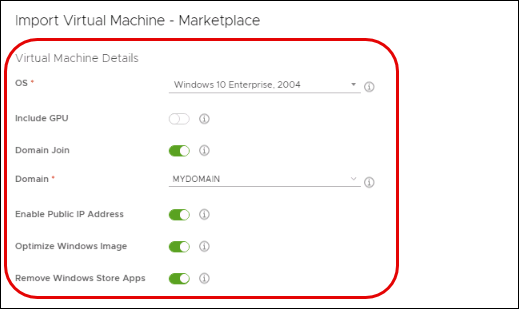

  - **OS:** Select **Windows 10 Enterprise, 2004** from the dropdown menu.

  - **Include GPU:** Slide **disable**

  - **Domain Join:** Slide **enable**
  
  - **Domain:** Select the Active Directory domain **<inject key="Domain NETBIOS Name" />** .

  - **Enable Public IP Address:** Select **Yes** to configure a public IP address so you can access the VM through an RDP connection.

  - **Optimize Windows Image:** **Enable** it to optimize Windows on image import, which improves VM performance and capacity utilization.

  - **Remove Windows Store Apps:** **Enable** it to remove Windows Store apps, also known as AppX packages, and disable automatic app and Windows Store updates and downloads. This improves performance and helps avoid Microsoft Windows Sysprep issues.

2. Scroll down to the next panel.

   

### **Task 4: Provide Admin Credentials for the Desktop**

1. Under Admin Credentials for the Desktop, provide the required information:

  - Username: **<inject key="Desktop Local Admin UserName" />**
  
  - Password: **<inject key="Desktop Local Admin Password" />**
  
  - Verify Password: **<inject key="Desktop Local Admin Password" />**
     
     

2. Scroll to the next panel.

   
### **Task 5: Provide Properties**

1. In the Admin Credentials for the Desktop panel and the Properties panel, provide the required information.

  - **Name:** Enter **Win10AppVolume**

  - **Description:** You can enter an optional description.

2. Select **ADVANCED OPTIONS** to reveal the Horizon Agent Features panel.

   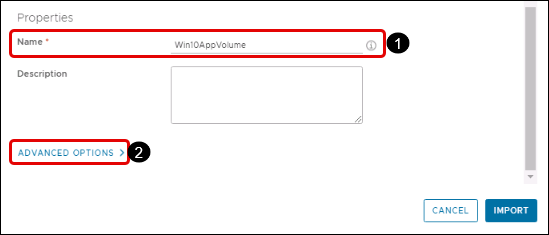

### **Task 6: Provide Horizon Agent Details**

1. Under Horizon Agent Features, accept the default to install all features in the golden VM:

  - **App Volume Agent:** Slide to **Enable** it.

    >**Note:** Installs the App Volumes Agent on the desktop.

  - **Enable Flash MMR:** Redirects Flash multimedia content sent to the client system and plays in a Flash container window using the Flash Player ActiveX version.

 
 - **3D support in Windows 10 MultiSession:** Slide to **Disable** it.
  
   >**Note:** Provides support for vGPU-powered 3D RDS hosts.

 
 - **MMR for Terminal Services:** Slide to **Enable** it. 
  
   >**Note:** Redirects multimedia content directly to the client computer, which plays the media content, offloading the demand on the RDS desktop and improving performance optimization.

 
 - **Client Drive Redirection:** Slide to **Enable** it.
  
   >**Note:** Allows you to share folders and drives on your local system with remote desktops and applications.

  - **Skype for Business:** Provides the ability to use the RDS desktops to make optimized audio and video calls with Skype for Business inside a virtual desktop without negatively affecting the virtual infrastructure and overloading the network.
  
  - **Webcam Support (Real Time Audio Video RTAV):** Allows you to run Skype, Webex, Google Hangouts, and other online conferencing applications on remote desktops with client local webcam and audio devices.

  
  - **Smart Card:** Slide to **Disable** it
  
    >**Note:** Lets you redirect smart cards from client to remote sessions for both SSO and in-session leverage.

  
  - **VMware Print:** Allows you to print to any printer configured for your local computer from a remote desktop or application without installing printer drivers on the remote desktop.

  - **Scanner Redirection:** Redirects scanning and imaging devices that are connected to the client systems so those devices can be used with the desktop or remote application.

 
 - **USB Redirection:** Enables redirection of USB devices that are connected to your local client system so those devices can be used with the desktop or remote application.

 
 - **URL Redirection:** Collects performance data from monitored software and hardware objects in your Horizon environment and provides predictive analysis and real-time information about problems in your Horizon infrastructure.

  - **Serial Port Redirection:** Enables devices connected to serial ports on your local client system so those devices can be used with the remote desktop or application.

  - **Geolocation Redirection:** Allows the geolocation information of the client system to be used by Internet Explorer in remote desktops.

  - **Help Desk:** Slide and **Enable** it to install the Help Desk.

2. In the lower right corner, click **IMPORT**.

   

3. Wait for the agent status to turn **Import successful** under Imported VM section before proceeding with the lab. Once the import is successful, a **Green dot** appears under Status.

   
   
>**Note: This process will take approximately 30 minutes to complete.**

## **Exercise 7.2: Converting the App Volume VM to an Image**

### **Task 1: Start Creating a New Image**

1. In the Horizon Cloud Service Administration Console navigation bar on the left, select **Inventory**.

2. In the Inventory menu, select **Images**.

3. In the Images window, click **New**.

   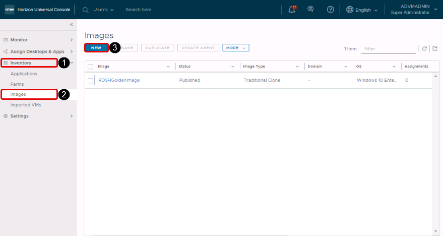

### **Task 2: Provide Convert Virtual Machine to Image Details**

1. In the New Image window under **Convert Desktop to Image**, provide the following information:

  - **Location:** Select the location to get a list of pods available to store the desktop.

  - **Pod:** Select the pod **pod-test**.

  - **Desktop:** From the list of desktops that can be converted to an image, select **Win10AppVolume**
  
   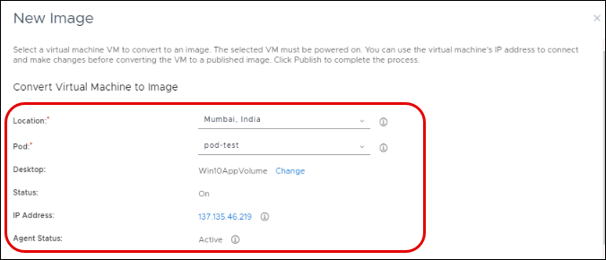

>**Note:** It may take few minutes for Agent status to turn **Active**.

### **Task 3: Provide OS Properties Details**

1. Under **OS Properties**, provide the following information:

  - **Image Name:** Leave default value.

  - **Company Name:** Enter an identifying name, which is used as the default in desktops that are created with this image.

  - **Timezone:** Set the time zone, to be the default time zone for all desktops created with this image.

   

### **Task 4: Provide Admin Credentials**

1. Under **Admin credentials for the desktop**, provide the account credentials for a valid administrator account in the selected image VM. Make sure to follow the complexity standards and other limitations.

   
   
   
  - Username: **<inject key="Desktop Local Admin UserName" />**

  - Password: **<inject key="Desktop Local Admin Password" />**
  
  - Confirm Password: **<inject key="Desktop Local Admin Password" />**

  - **Note:** These credentials are the user name and password that were entered in the wizard when the App Volume VM was created in the Imported VMs window.

2. In the lower right corner, click **Publish**.

### **Task 5: Wait for the Published Status**

1. Wait until the status changes to **Published** to use the assignable image for creating a farm.

   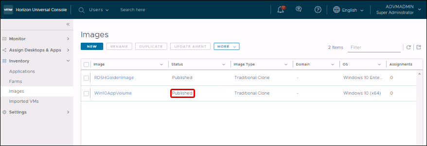

For more information, see [_VMware Horizon Cloud Service on Microsoft Azure Administration Guide_](https://docs.vmware.com/en/VMware-Horizon-Cloud-Service-on-Microsoft-Azure/index.html), and search the guide for **Convert a Configured Master Virtual Machine to an Assignable Image**.

## **Exercise 7.2: Addding a Application from App Volume**

### **Task 1: Add New Applications**

1. In the Horizon Cloud Service Administration Console click on **Applications** in navigation bar.

2. Then navigate to **App Volumes** tab and click on **New** then select **Create**.

   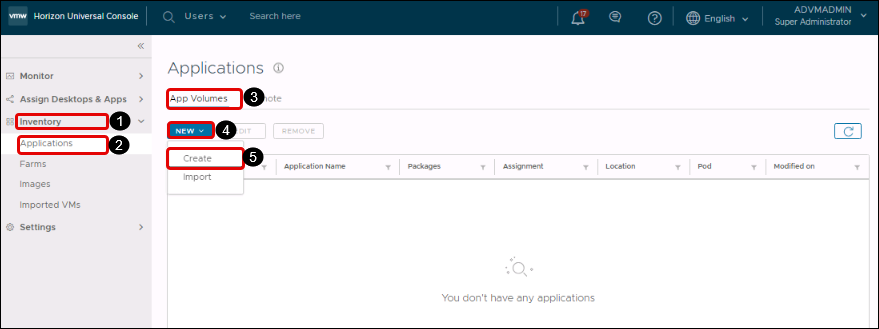

### **Task 2: Provide Definition Information**

   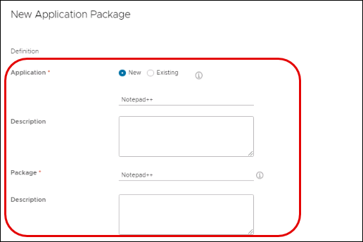
   
   - **Application:** Select **New** and enter value as **Notepad++**
   - **Package:** Enter **Notepad++**

### **Task 3: Provide Pod Details**

1. Provide following details of the Pod

   
   
   - **Location:** Enter the location which we used to create Pod in Exercise 1
   - **Pod:** Select the name of the Pod we created in Exercise 1
   - **Image:** Select **Win10AppVolume**

2. In lower right corner click on **Save**.

### **Task 4: Verify Addition of New Applications**

   

   In the Applications window, the green dots indicate that each application is active.

   >**Note:** We may have to click on refresh icon to see the Active status.

### **Task 5: Capture the App Package**

1. Click on the name of the application which we deployed in the last task.

   
   
2. Wait for the status to turn **"Desktop ready for application capture"**. It may take around 40 minutes for it to complete.

   
   
   >**Note:** We may have to click on **Refresh** icon to get the status.

3. Select the application and click on **START CAPTURE** button.

   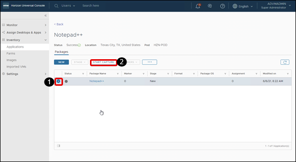

4. Now we will be redirected to a new tab which is directed to broker URL, Enter the following credentials.

   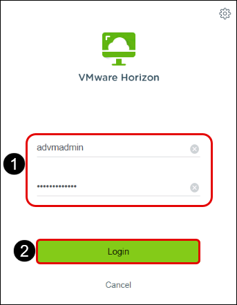

  - Username: **<inject key="AD VM Admin UserName" />**

  - Password: **<inject key="AD VM Admin Password" />**

5. Double click on the **appcapture** session to launch it.

   

4. A Desktopsession will start in a new tab with App Package dialog saying *Packing*.

   
   
   >**Note:** It may take around 15 minutes for the Session to login.
   

### Task 6: Installing the App and creating the App Package

1. Open Run in the desktop session and enter `\\10.0.0.4\c$\LabFiles` and click on **Ok** to navigate to the directry of the installer.

   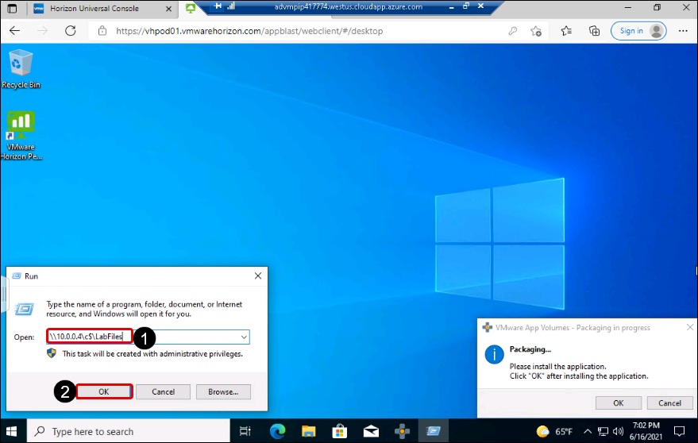
   
2. Now double click on the application installer to run it and navigate through the installer by clicking on **Next**.

   

   >**Note:** If you get following prompt while executing the installer then click on **Run**.
   >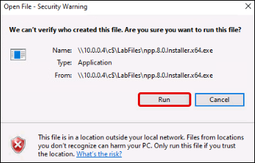
   

3. At the last page of installer **uncheck** the box asking to *Run the application after installation* and click on **Finish**.

   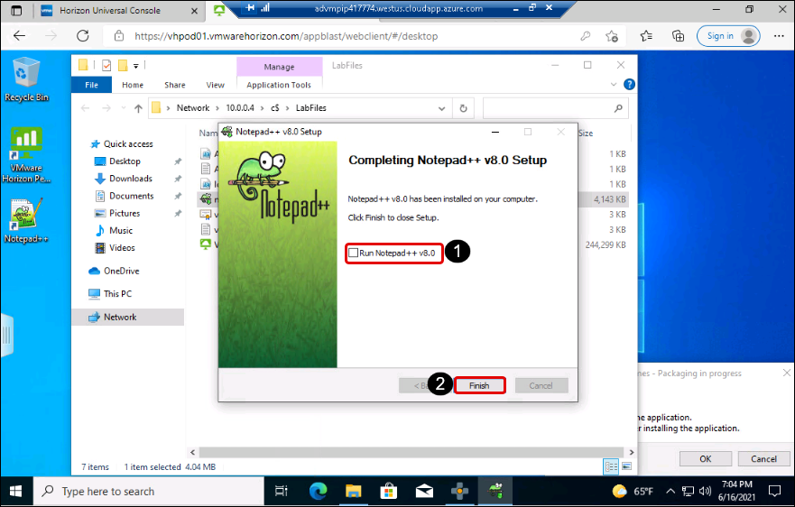

4. After application installation completes click on **Ok** under App Volume dialog box.

   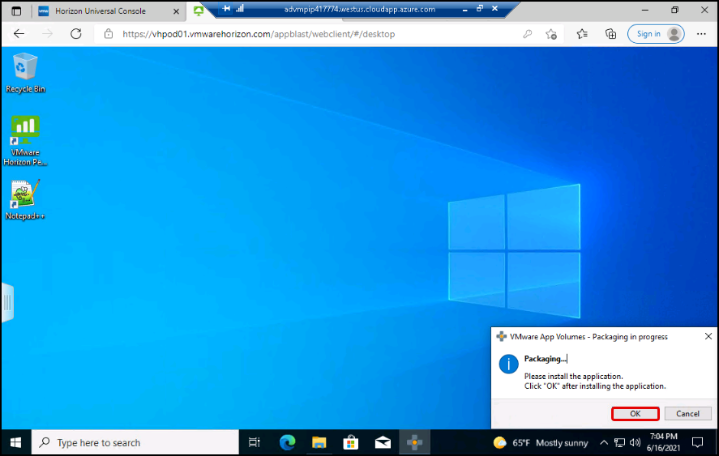

5. Click on **Yes** to confirm the installation of application.

   
   
6. On a prompt to **Finalize Package** click on **Finalize**.

   

7. Under **Restart Required** prompt click on **Ok** to restart the session.

   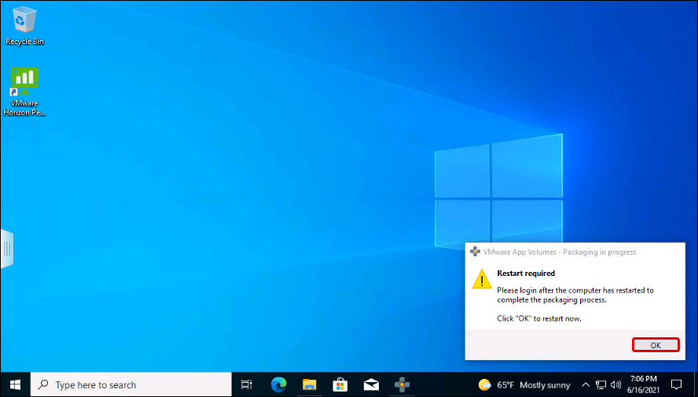

8. Now we will be disconnected from the session desktop, click on **Close** button to continue.

   
   
9. Now reconnect to session desktop by clicking on the session icon then enter the password: **<inject key="all Account Password" props="{\&quot;enableCopy\&quot;:true,\&quot;style\&quot;:{\&quot;fontWeight\&quot;:\&quot;bold\&quot;}}" />**  and click on **Login** button.

   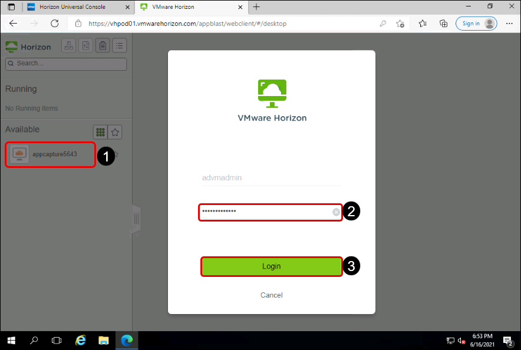

10. There might be a promp asking you to wait until the session desktop restarts, wait for the session desktop to launch.

   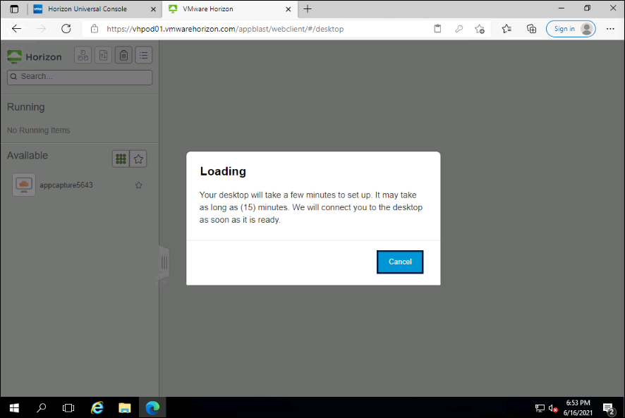

11. After reconnecting to the session desktop wait for the package finalization to complete with a **Packaging Sucessful** prompt.

   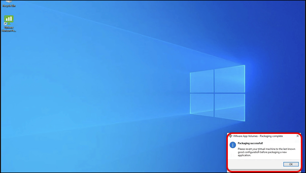
   
12. Now return back to the App Volume console and click on the refresh icon to see the status as green dot depicting the status of App Packaging was successful.

   

   >**Note:** It may take few minutes for the changes to be reflected.

13. We can also click on the **Bell icon** on top to check on the status of Application Package.

   

## **Exercise 7.3: Creating a Desktop and Apps Assignment**

### **Task 1: Assign New**

1. In the navigation pane on the left, click **Assign Desktops & Apps** and select **VDI & App Volumes** from dropdown menu.

2. In the Assignments window, click **New** and select **App Volumes**.

   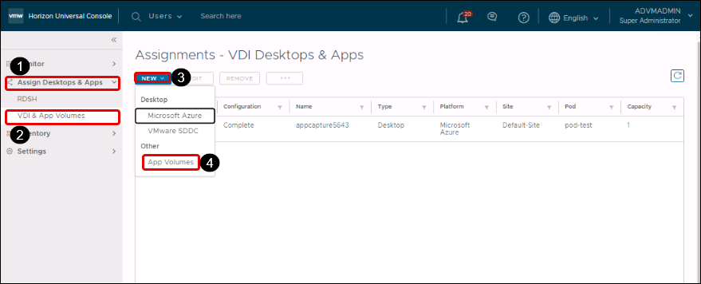

### **Task 2: Provide Definition**

1. Provide the following details and click on **Next**.

   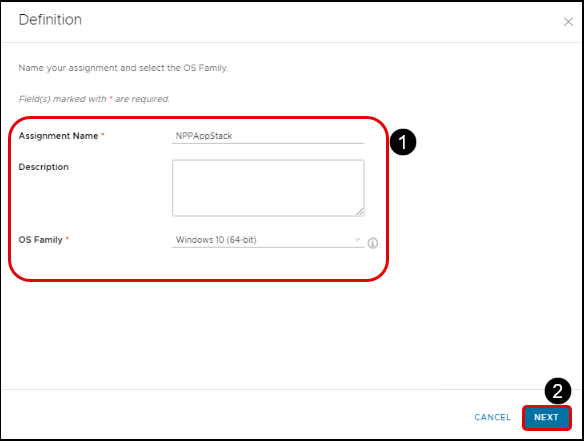
   
   - **Assignment Name:** Provide a rememberable Assignment Name.
   - **OS Family:** Select **Windows 10 (64-bit)**

### **Task 3: Select Applications**

   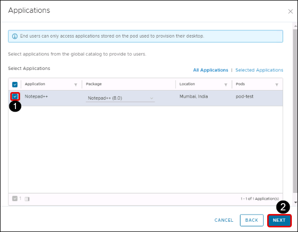
   
In the Applications window select the application and click on **Next**.

### **Task 4: Assign Users**

   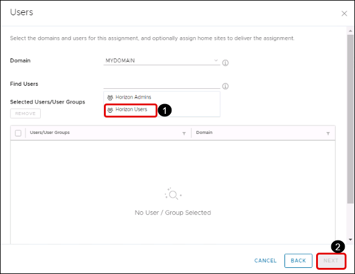

   - **Domain:** Leave it to the default value.
   - **Find Users:** Select **Horizon Users**

Click on **Next**.

### **Task 5: Review the Summary**

   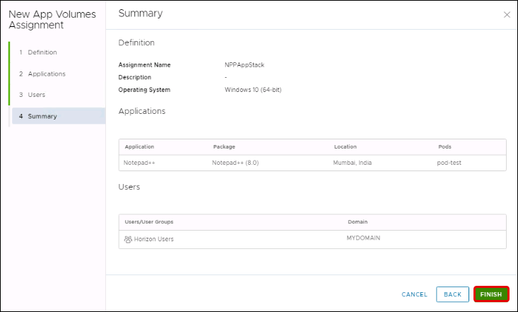

Review the Summary and click on **FINISH**.

### **Task 6: Verify in the Assignments Window**

   

Click on the refresh icon and make sure that the Status of the Assignment is **Online** *(Depicted with a green tick)*.

## **Task 7: Verifying App Volume**

1. Launch **Horizon Client** from Desktop of ADVM Virtual Machine and double click on **vdi.mydomain.local**.

   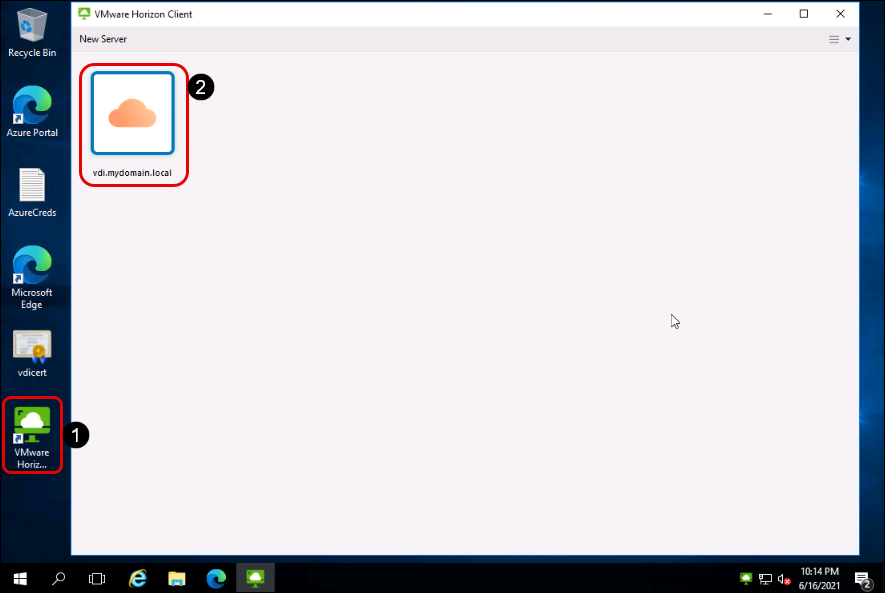

2. Use the following credentials to login.

   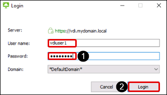

  - Username: <inject key="vdi Username 1" props="{\&quot;enableCopy\&quot;:true,\&quot;style\&quot;:{\&quot;fontWeight\&quot;:\&quot;bold\&quot;}}" />
  
  - Password: <inject key="all Account Password" props="{\&quot;enableCopy\&quot;:true,\&quot;style\&quot;:{\&quot;fontWeight\&quot;:\&quot;bold\&quot;}}" />
  
  - Domain: Leave on **DefaultDomain**

3. Double click on **DesktopAssignment**.

   

4. After SessionDesktop is launched, the application can be seen present inside the session.

   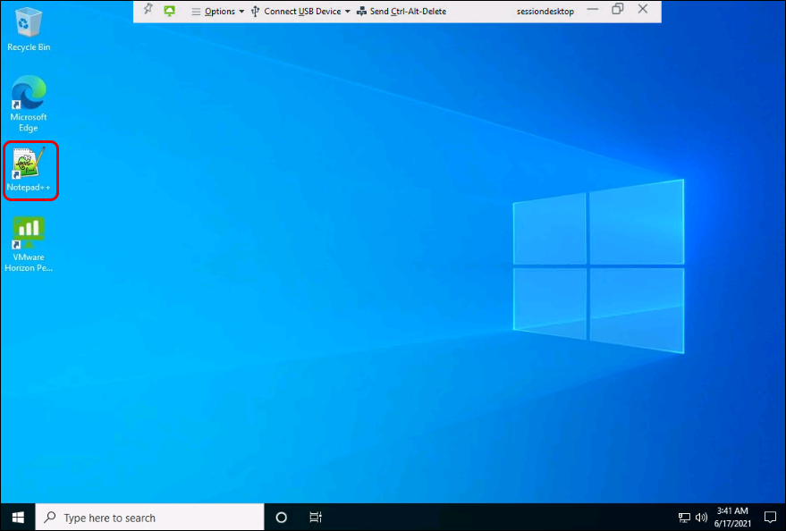
   >**Note:** If the icon is not found on the desktop then the Application can be searched from Start Menu.

5. To close the Session Desktop click on the **X** icon.

   

Click on the **Next** button from lower right corner of the guide to move on the next page.
   
