# **Exercise 8: Dynamic Environment Manager in Horizon Cloud on Azure**

## **Exercise 8.1: Explore the VMware Dynamic Environment Manager console**

### **Task 1: Validate the deployment of the Dynamic Environment Manager**

1. In AdVM open the explorer and navigate to `F:\` drive and validate the deployment of the DEM is successful. There are three folders created for DEM named **DEMConfig**, **DEMProfile** and **UserData**. These folders are shared as per DEM prerequisite.
  
  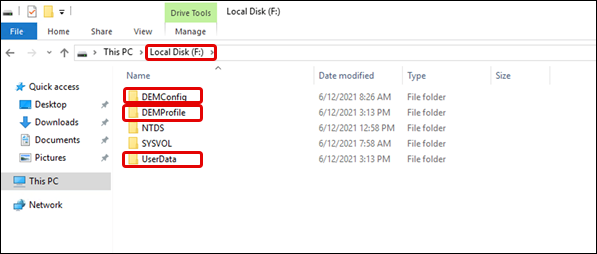

2. Open Start Menu and open **Management Console* under recently added application or **VMware DEM** folder as shown below.

   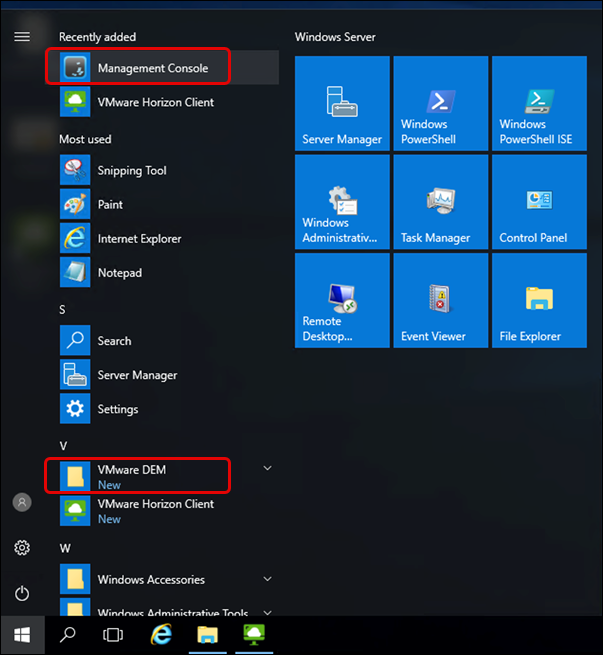

3. Explore the **VMware Dynamic Environment Manager console**.

   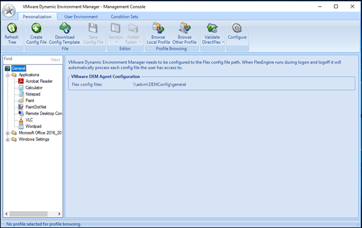

4. Navigate to **User Environment** > **Drive Mapping** > **HomeDrive**. Click on **Edit** and review that HomeDrive is mapped to user with Frienldy name as Home.

   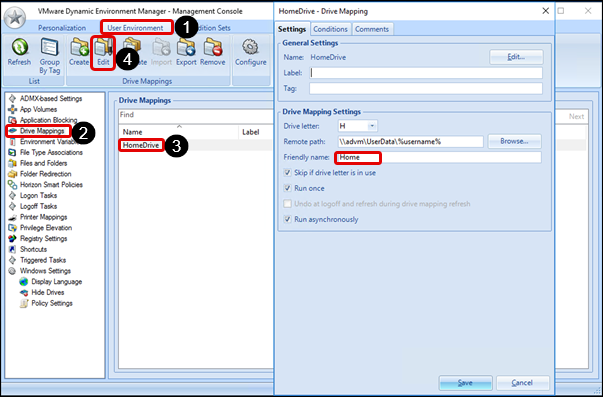
   >**Note:** Click on **X** icon on Drive Mapping window to close it.

5. Navigate to **User Environment** > **Folder Redirection** > **Profile** and click on **Edit** and review that user’s windows profile foders are redirected to home drive.

   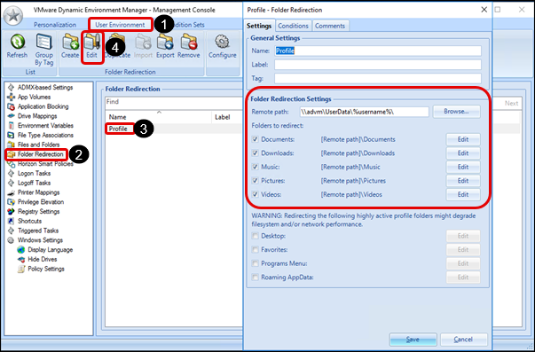

6.	Navigate to **User Environment** > **Windows Settings** > **Hide Drives** > **Hide some drives**  and click on **Edit**. Now you can see that A, B, C drive are hidden.

   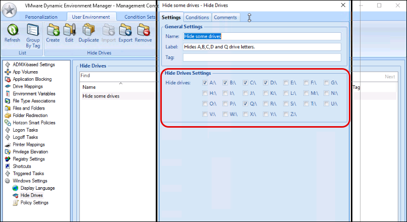

### **Task 2: Explore Policies configured for Dynamic Environment Manager**

1. In your ADVM virtual machine, Open **Run** promt and launch **gpmc.msc**.

   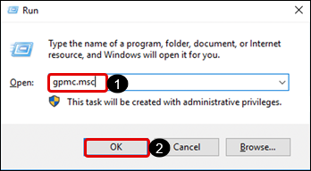
   
2. Navigate the **mydomain.local** > **Horizon OU** and click on **FlexEngine**. Click on **Settings** on the right hand side and see all the policies configured for DEM.

   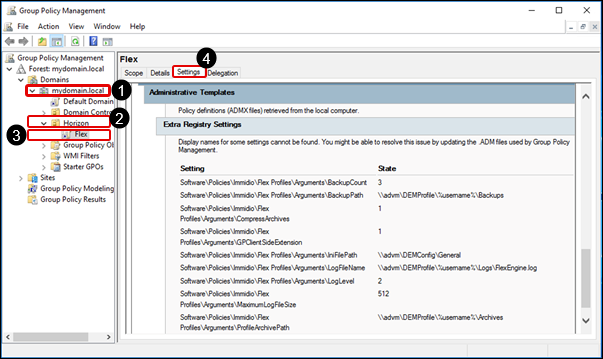

## **Exercise 8.2: Experience Dynamic Environment Manager**

### **Task 1: Login into your Session Desktop**

1. In AdVM, open VMHorizon Client given on the desktop.

   

2. Now on the Horizon Client double click on **vdi.mydomain.local**.

   

3. Enter the password for **vdiuser1** and click on **Login**.

   - Password: **<inject key="all Account Password" props="{\&quot;enableCopy\&quot;:true,\&quot;style\&quot;:{\&quot;fontWeight\&quot;:\&quot;bold\&quot;}}" />**

   
   

4. Double click on the **DesktopAssignment** to launch the SessionDesktop.

   

5. Launch the **README** text file on the Desktop and note down the machine name on which you are logged into.

   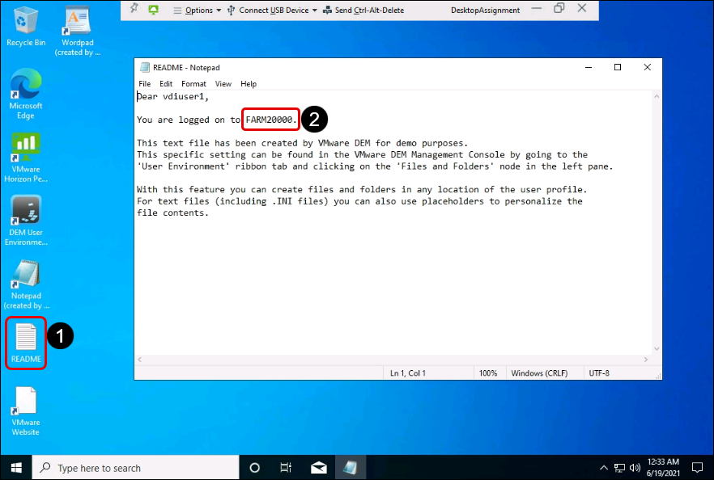

6. Navigate to **Format** > **Fonts**. Change the font of the notepad and click **OK**.

   
   
7.	Close the Notepad.

8. Launch Explorer and validate that **Home drive** is available to user and C drive is not visible.

   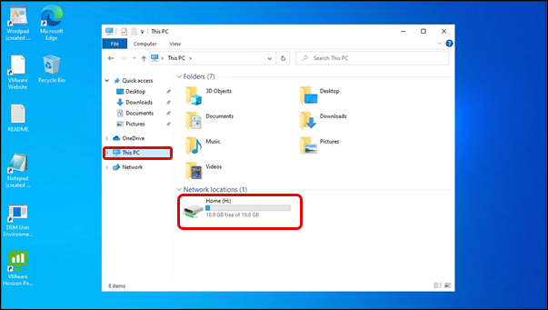

9. Open the **Home** drive `(H:)` and see user’s profile folders are created inside home drive. Create a **.txt** test file in Home Drive.

   

10. **Right click** on the desktop and click on **Personalize**.

   

11. Select a different background and close the settings window.

   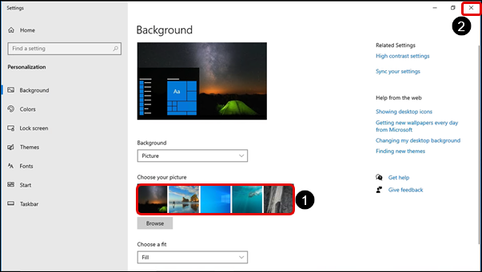

12. The new background should be applied.

   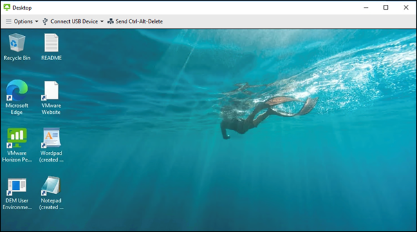

13. Sign Out from the DesktopSession by going to **Start Menu**, then clicking on **User** icon and selecting **Sign Out**.

   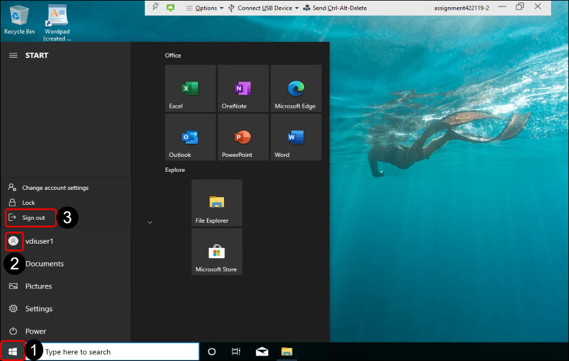
    

14. Login to Horizon cloud console if not already and navigate to **Inventory** > **Farms** > **SecondFarm** *(Desktop Farm)*. 

   

15. Navigate to the **Session Hosts** tab and select the Name of the machine we noted in *Step 5* and click on **USER LOGIN MODE** and click on **Prevent New Logins and Reconnections (Disabled)**
   
   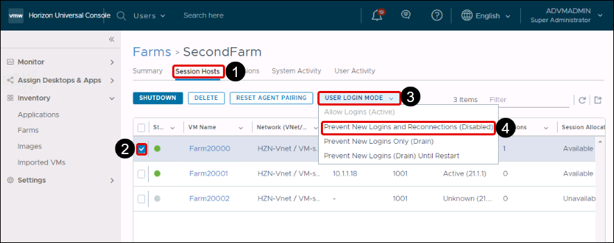
   
15. On a prompt asking *Prevent New Logins and Reconnections (Disabled)*, Click on **Continue**.

    
   
16. Wait till you see the agent status as Disabled.

   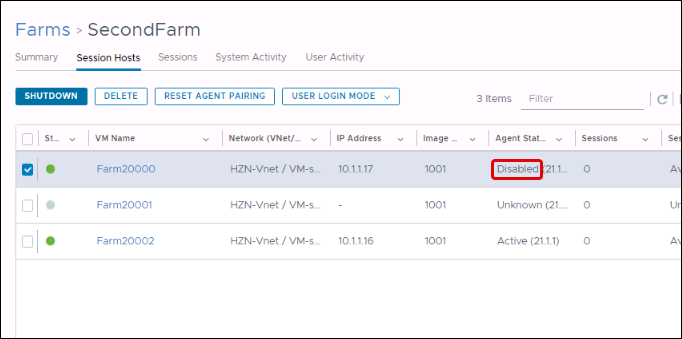

17. In AdVM, open VMHorizon Client given on the desktop.

   

18. Now on the Horizon Client double click on **vdi.mydomain.local**.

   

19. Enter the password for **vdiuser1** and click on **Login**.

   - Password: <inject key="all Account Password" props="{\&quot;enableCopy\&quot;:true,\&quot;style\&quot;:{\&quot;fontWeight\&quot;:\&quot;bold\&quot;}}" />

   

20. While logging into Session Desktop, you see that *VMware Dynamic Enviroment manager policy* getting applied.

   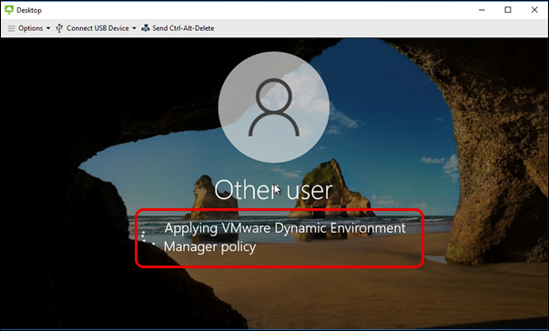
   
21. We can see that the desktop wallpaper is retained from our last change as done in *Step 11*. 

    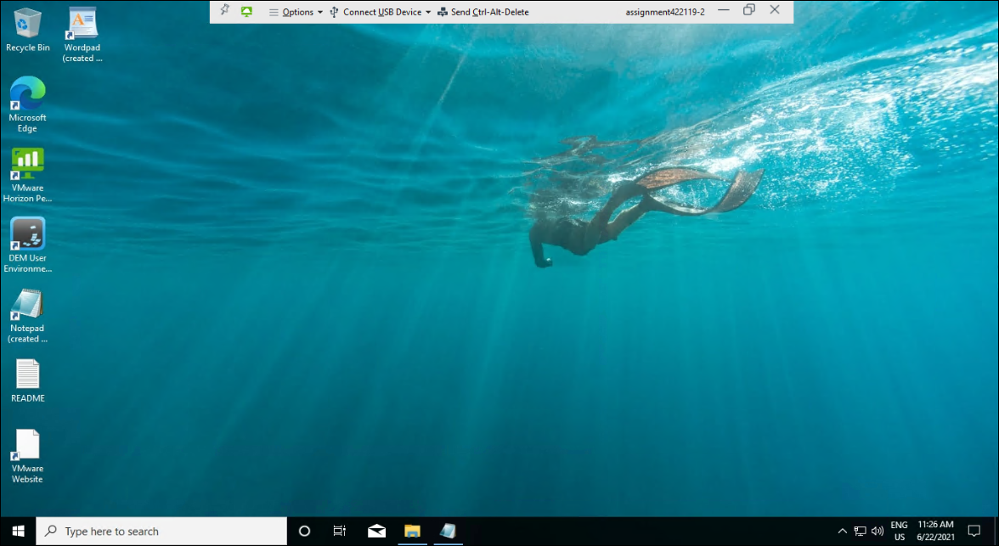
    
22. Open the **README** file on desktop and validate you are logged into new Session Desktop and the font in notepad is also retained.

   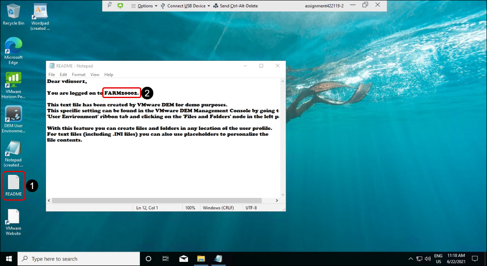

23. Open the **File explorer** and go to **Home** drive, verify if the file is still retained. 

   
   
